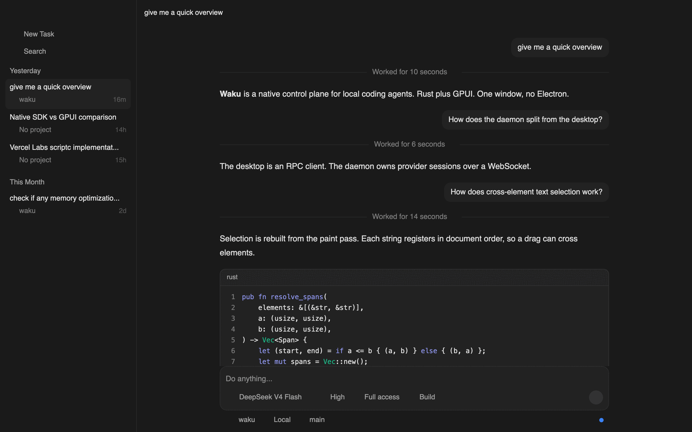
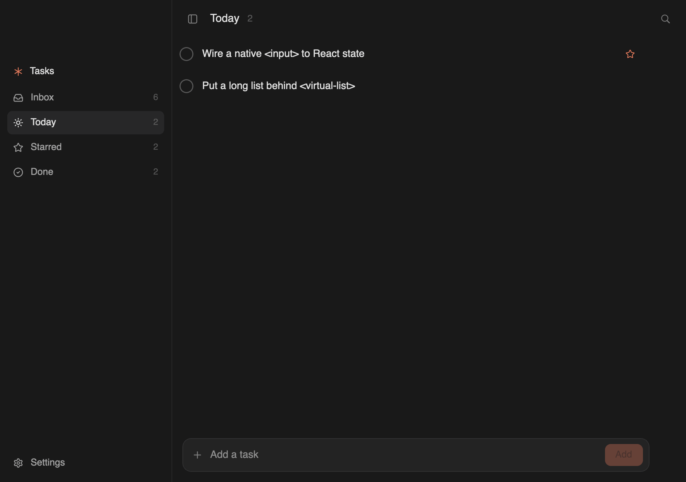
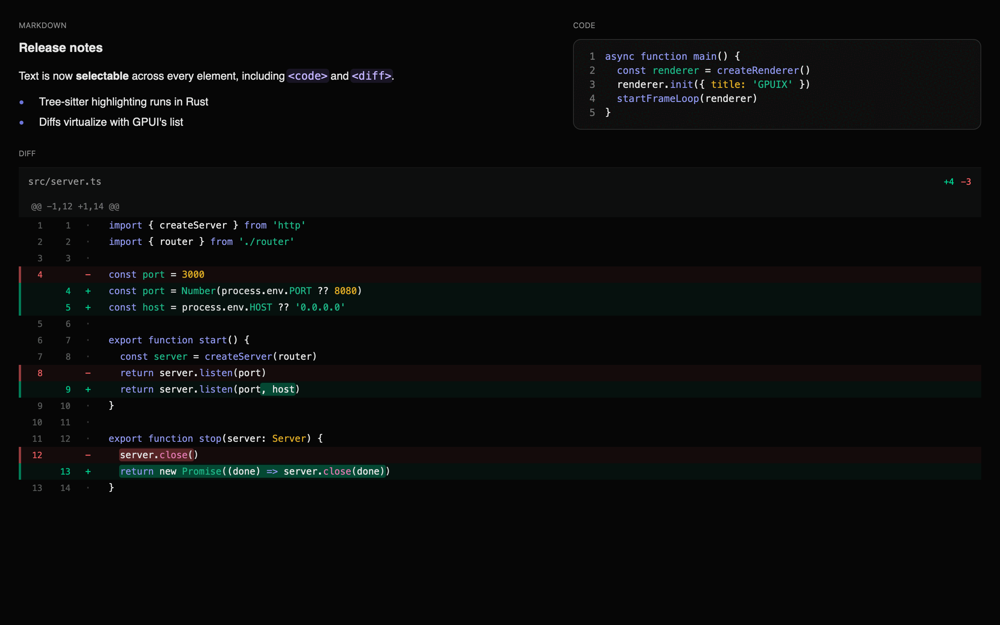
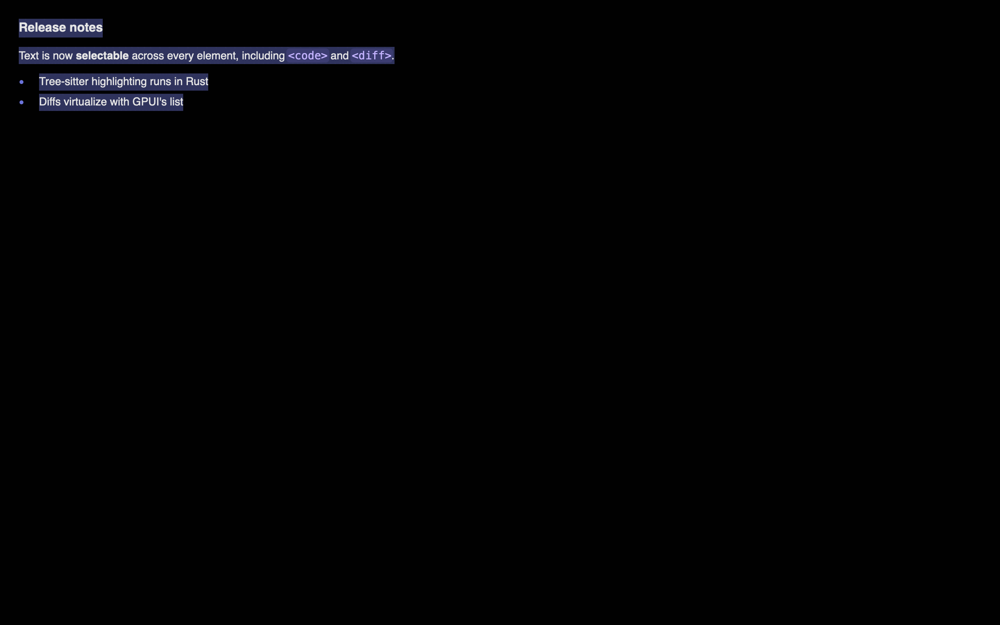
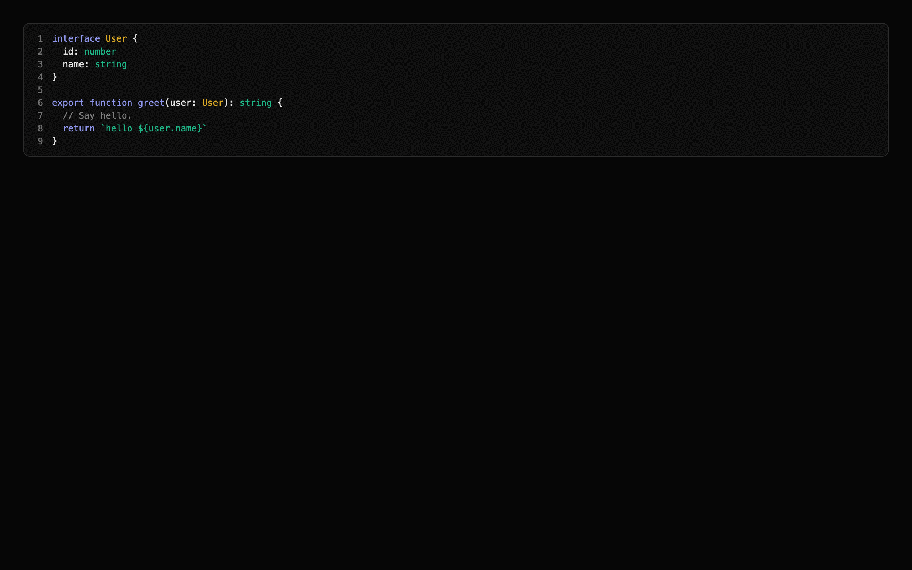
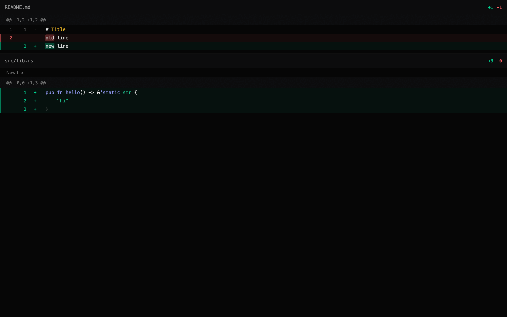
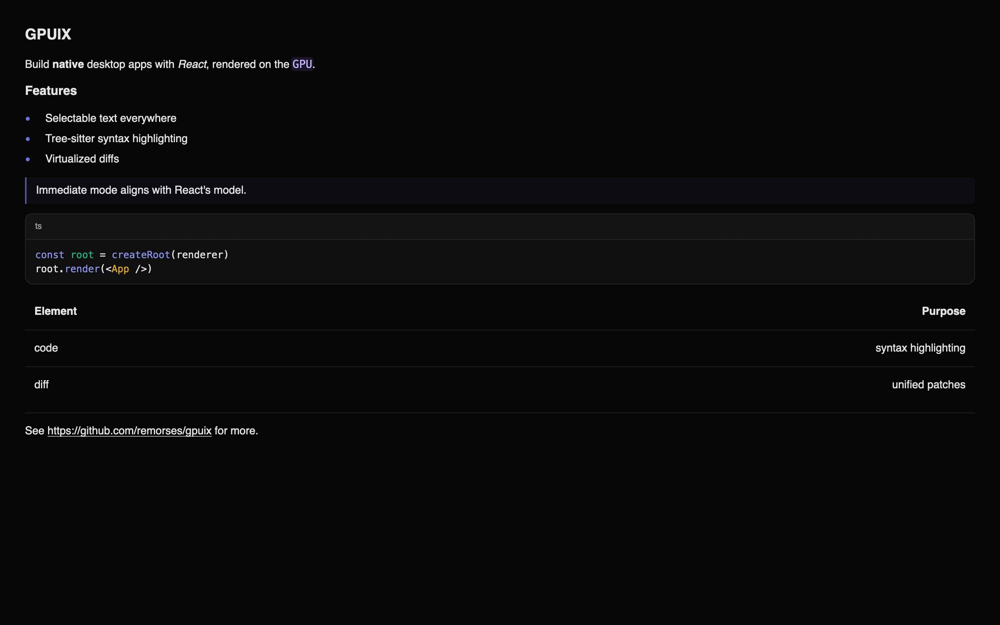
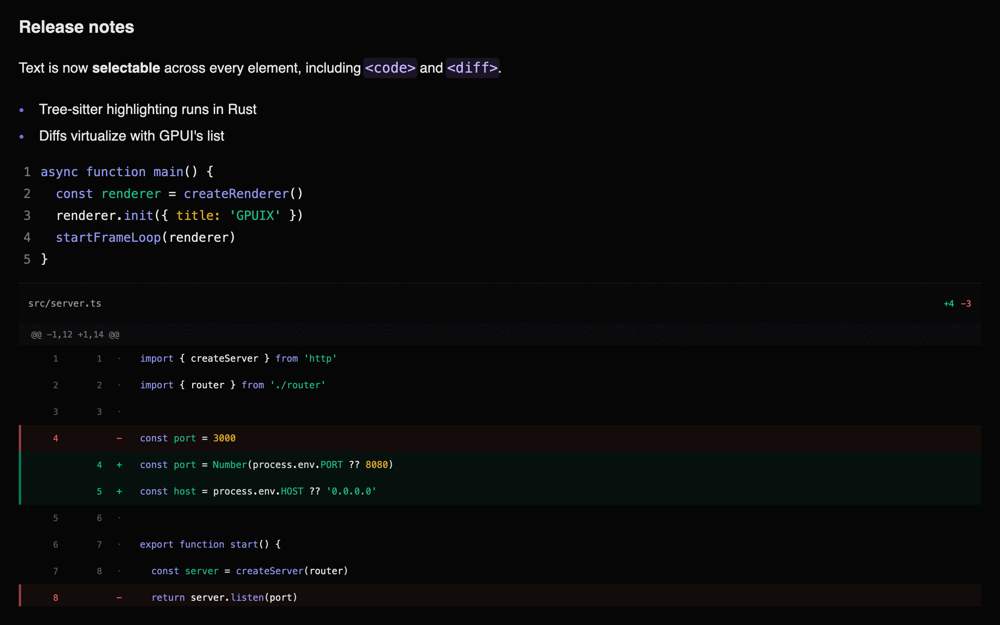

# GPUIX

> [!NOTE]
> **Ernxst/gpuix** is a fork of [remorses/gpuix](https://github.com/remorses/gpuix) that keeps one codebase for web and desktop, with DOM/CSS semantics as the source of truth. It tracks and reconciles with upstream regularly; fork-specific divergences are recorded in [`.changeset/`](./.changeset). This fork intentionally does **not** publish packages to npm.

React bindings for [GPUI](https://github.com/zed-industries/zed/tree/main/crates/gpui) - Zed's GPU-accelerated UI framework.

Build native GPU-accelerated desktop apps with React and TypeScript. Your components render directly to the GPU via Metal, DirectX, or Vulkan. No Electron, no web views.



Everything above is GPUIX: the sidebar, the scrolling list, the composer,
and native `<markdown>`. Start it with **`bun --hot`** so a save remounts React
and reconnects its event handlers on the same window:

```bash
cd examples && bun --hot chat.tsx
```

## Quickstart

Install two packages. `@gpuix/react` pulls the native renderer for your
platform, so there is nothing to build and no Rust toolchain to install.

```bash
bun add @gpuix/react react
bun add -d @types/react typescript
```

### 1. Point TypeScript at the GPUIX JSX types

**`jsxImportSource` is required.** Without it TypeScript uses DOM types, so
`<virtual-list>`, `<markdown>`, `<code>` and `style.hover` all fail to
typecheck.

```json
{
  "compilerOptions": {
    "target": "ES2022",
    "module": "ESNext",
    "moduleResolution": "bundler",
    "jsx": "react-jsx",
    "jsxImportSource": "@gpuix/react",
    "strict": true,
    "skipLibCheck": true,
    "noEmit": true
  }
}
```

### 2. Write the entry file

End the file with `render()`. That call creates the window, mounts React, and
starts the frame loop.

```tsx
import { useState } from 'react'
import { render } from '@gpuix/react'

function App() {
  const [count, setCount] = useState(0)
  return (
    <div style={{ padding: 24, backgroundColor: '#1a1a1a', height: '100%' }}>
      <div
        onClick={() => setCount((c) => c + 1)}
        style={{
          padding: 12,
          borderRadius: 8,
          cursor: 'pointer',
          backgroundColor: '#232323',
          hover: { backgroundColor: '#2c2c2c' },
        }}
      >
        <text style={{ color: '#e2e2e2' }}>Count: {count}</text>
      </div>
    </div>
  )
}

render(<App />, { title: 'My App', width: 800, height: 600 })
```

> [!IMPORTANT]
> **Give every `<text>` a `color`.** GPUI does not inherit `color` from a
> parent, so text with no color paints **black** and disappears on a dark
> surface.

### 3. Run it

```bash
bun --hot app.tsx
```

Use `bun --hot`, not plain `bun`. A save then remounts React on the same
window instead of opening a second one.

### 4. Ship a binary

```bash
bun build --compile app.tsx --outfile dist/app
./dist/app
```

The binary carries the renderer, so it runs with no Bun and no Node install.

### Start from the example app

[`example-app/`](https://github.com/remorses/gpuix/tree/main/example-app) is a complete todo app in one file, with `dev`,
`build`, `web:dev` and `typecheck` scripts already wired. Copy the folder,
change `@gpuix/react` from `workspace:^` to a version range, and run
`bun install`.



## Examples

| Example | Run | What it shows |
|---|---|---|
| **todo** | `bun run dev` in [`example-app/`](https://github.com/remorses/gpuix/tree/main/example-app) | The starting point: one file, a `<virtual-list>`, a native `<input>`, and an animated sidebar |
| **blurred window** | `bun run blurred-window` | A macOS frosted-glass surface using GPUI's native vibrancy backdrop and transparent titlebar |
| **chat** | `bun --hot chat.tsx` | A GPUIX app: transparent titlebar, animated sidebar, message list, composer, `<markdown>` |
| **timeline** | `bun --hot timeline.tsx` | A video-editor timeline: clip dragging, edge trimming with snapping, playhead scrubbing, marquee selection, zoom under the pointer, and a two-axis pan with a frozen ruler and track column |
| **native-text** | `bun --hot native-text.tsx` | The three native text components with a tab switcher |
| **reduced-motion** | `bun --hot reduced-motion.tsx` | Style and `motion.div` transitions following macOS Reduce Motion live |
| **counter** | `bun --hot counter.tsx` | The smallest possible app: state, events, hover |
| **menus** | `bun --hot menus.tsx` | Application menus, JS menu actions, explicit quit, and graceful termination |
| **diff** | `bun --hot diff.tsx` | A diff viewer composed from `<div>` and `<text>` in JS, for comparison |
| **web** | `bun run web` from the repository root | The ChatGPT example rendered in a browser canvas with WebGPU |

The todo app lives in [`example-app/`](https://github.com/remorses/gpuix/tree/main/example-app) and is meant to be copied.
The rest live in [`examples/`](https://github.com/remorses/gpuix/tree/main/examples). All of them use hardcoded data.

Or download a standalone **chat** build from the [GitHub release](https://github.com/remorses/gpuix/releases). No Bun or Rust install is required.

```bash
tar -xzf example-chat-aarch64-apple-darwin.tar.gz
./example-chat-aarch64-apple-darwin
```

The archive keeps the executable bit, so there is no `chmod` step. macOS may still block the unsigned binary the first time. Right-click the file, choose **Open**, and confirm.

On Windows, download `example-chat-x86_64-pc-windows-msvc.exe` and double-click it. On Linux, the file is `example-chat-x86_64-unknown-linux-gnu.tar.gz`.

The web example bundles the same React app and reconciler as the desktop chat
example. wasm-bindgen exposes the mutation interface to the existing retained
tree and `GpuixView`, which run through GPUI's browser platform. Browser event
callbacks are not supported yet.

The web build needs nightly Rust and the matching wasm-bindgen CLI:

```bash
rustup toolchain install nightly --component rust-src --target wasm32-unknown-unknown
cargo install wasm-bindgen-cli --version 0.2.127 --locked
bun run web
```

The generated Wasm uses shared memory, so the page must be cross-origin
isolated. Production servers must send these headers on the **top-level
document**:

```http
Cross-Origin-Opener-Policy: same-origin
Cross-Origin-Embedder-Policy: require-corp
```

`require-corp` then constrains **cross-origin** subresources, which must supply
their own CORS or `Cross-Origin-Resource-Policy`. Serve the JavaScript and the
Wasm from the same origin as the document and nothing else is needed.

`bun run web` rebuilds the Wasm only when `packages/native/wasm` is missing.
After a Rust change, force it:

```bash
bun scripts/web.ts --rebuild
```

#### Hot reload in the browser

`bun run web` serves the example through Bun's frontend dev server, so an edit
to `examples/chat.tsx` arrives as a **React Fast Refresh** update. Components
swap in place and `useState` survives, which means the composer text, the
sidebar selection, and the scroll position all stay where they were. The GPUI
canvas is never re-created and the ~19 MB Wasm module is never re-fetched.

Fast Refresh only applies to a module whose exports are all components. Edit
anything else, such as the entry file, and Bun reloads the page instead. Both
paths are correct; the reload is only slower.

The Wasm half is a **singleton and must never re-evaluate**.
`WebGpuixRenderer::init` fails with `GPUIX web is already running` once its
thread-local app exists, and GPUI's browser platform appends its own canvas to
`<body>`. What protects it is not that it lives in `node_modules`; Bun bundles
it into the same client registry as your app. It is that Bun re-runs only the
**changed** module and then walks upward through its importers, so an unchanged
dependency stays evaluated and cached. Two rules follow:

- do not call `import.meta.hot.accept("./your-app", ...)` in the entry file.
  Bun runs an importer's dependency-accept callback **even when the imported
  module already self-accepted**, so that callback would remount the tree on top
  of a successful refresh and throw away every `useState`
- keep the `@gpuix/native` import in a module that can never become a Refresh
  boundary and is never explicitly accepted

The chat example puts a virtualized `<diff>` and a GFM table inside an assistant
turn, inside a scrolling transcript:


Markdown, code and a virtualized diff in one frame:



## Architecture

GPUIX bridges React to GPUI using a **mutation-based protocol**. Desktop apps use napi-rs; browser apps load the same Rust renderer through wasm-bindgen. React collects changed elements into one atomic mutation batch per commit. Rust applies that batch to a retained element tree that GPUI reads each frame.

```
┌─────────────────────────────────────────────────────────────────┐
│  React (JavaScript)                                             │
│                                                                 │
│  function App() {                                               │
│    const [count, setCount] = useState(0)                        │
│    return (                                                     │
│      <div style={{ display: 'flex', gap: 8 }}>                  │
│        <div onClick={() => setCount(c => c + 1)}>               │
│          Count: {count}                                         │
│        </div>                                                   │
│      </div>                                                     │
│    )                                                            │
│  }                                                              │
└─────────────────────────────────────────────────────────────────┘
                    │ napi desktop / wasm-bindgen browser
                    │ applyBatch([
                    │   ["createElement", 1, "div"],
                    │   ["setStyle", 1, {...}],
                    │   ["setRoot", 1]
                    │ ])
                    ▼
┌─────────────────────────────────────────────────────────────────┐
│  Rust host bridge                                               │
│                                                                 │
│  RetainedTree ── stores elements, styles, event flags           │
│       │                                                         │
│       ▼  each GPUI frame                                        │
│  GpuixView::render() → build_element() → GPUI elements          │
└─────────────────────────────────────────────────────────────────┘
                    │
                    ▼
┌─────────────────────────────────────────────────────────────────┐
│  GPUI                                                           │
│                                                                 │
│  Metal, DirectX, Vulkan, or browser WebGPU / WebGL2             │
│  Flexbox layout via Taffy                                       │
└─────────────────────────────────────────────────────────────────┘
```

## Why This Works

GPUI is an **immediate-mode** UI framework — it rebuilds the entire element tree every frame. Instead of fighting this, GPUIX embraces it:

1. React reconciler detects a state change and queues host mutations (`createElement`, `setStyle`, `appendChild`, etc.)
2. `applyBatch()` validates and applies the complete commit to the Rust **RetainedTree**
3. On each GPUI frame, `GpuixView::render()` walks the RetainedTree and calls `build_element()` to produce ephemeral GPUI elements
4. GPUI lays them out (Taffy flexbox) and renders to the GPU
5. Only **changed elements** cross the FFI boundary — React's reconciler diffs the virtual tree and sends minimal mutations

This is the same protocol React uses for the DOM (`createElement`, `appendChild`, `removeChild`, `commitUpdate`), but targeting a GPU renderer instead of a browser.

## Mutation API

The mutation surface between JS and Rust is one atomic method. Desktop uses napi and the browser uses wasm-bindgen:

```ts
interface NativeRenderer {
  applyBatch(json: string): Array<number>
}
```

Element IDs are plain numbers generated by an incrementing counter in JS. React may abandon work in concurrent render mode, so GPUIX keeps new host nodes in JS until React places the accepted subtree during commit. Only then are its mutations added to the batch. `applyBatch()` applies that accepted commit atomically and marks the Rust view dirty for the next frame.

## Event Flow

On desktop, events travel from GPUI back to React through a `ThreadsafeFunction` callback. Browser event callbacks are not connected yet.

```
User clicks element id=3
       │
       ▼
GPUI fires on_click on the element
       │
       ▼
Rust closure calls emit_event_full(callback, 3, "click", {x, y, ...})
       │
       ▼
ThreadsafeFunction queues EventPayload on Node.js event loop
       │
       ▼
JS event registry: eventHandlers.get(3)?.get("click")?.(payload)
       │
       ▼
React handler runs: onClick={() => setCount(c => c + 1)}
       │
       ▼
State update triggers re-render → reconciler sends mutations back to Rust
```

Event handlers are stored in a JS-side registry keyed by `(elementId, eventType)`. Rust only knows **whether** an element has a listener (via `setEventListener`), not the closure itself — the actual handler lives in JS.

Handlers receive a `GpuixSyntheticEvent`, not the raw native payload. Native
fields such as `key`, `x`, and `value` remain available at the top level and
the unchanged payload is exposed as `nativeEvent`. The synthetic surface adds:

- `target` and phase-specific `currentTarget` host handles with
  `getAttribute(name)`
- flattened `altKey`, `ctrlKey`, `metaKey`, and `shiftKey` values
- a primary-button default (`button === 0`)
- capture and bubble dispatch through the retained React ancestry
- `preventDefault()` / `defaultPrevented` and `stopPropagation()`

`handleGpuixEvent()` returns the synchronous prevention result. A prevented
Enter or Space key event cancels the keyboard-generated click that follows. A
prevented Tab or Shift+Tab keydown likewise keeps focus on the current element.

## Packages

- **`@gpuix/native`** — Rust bindings to GPUI. It publishes napi-rs desktop binaries and a wasm-bindgen browser build, both backed by `GpuixRenderer`, `RetainedTree`, `build_element()`, and `apply_styles()`.
- **`@gpuix/react`** — React reconciler, event registry, and TypeScript types. Implements the `react-reconciler` host config using the mutation API.

## Building

This section is for **working on GPUIX itself**. To build an app with it, see
[Quickstart](#quickstart) instead. Installing the packages needs no Rust
toolchain and no submodule.

### Prerequisites

1. Rust toolchain
2. Node.js 18+
3. Xcode with Metal Toolchain (macOS)

```bash
# Install Metal Toolchain if needed
xcodebuild -downloadComponent MetalToolchain

# Install dependencies
bun install

# Check out the pinned GPUI fork
git submodule update --init --recursive

# Build native package
cd packages/native
bun run build

# Build React package
cd ../react
bun run build

# Run example (use tmux for long-running sessions)
cd ../../examples
bun --hot counter.tsx
```

## Usage

```tsx
import React, { useState } from 'react'
import { render } from '@gpuix/react'

function App() {
  const [count, setCount] = useState(0)
  return (
    <div style={{ display: 'flex', gap: 8, padding: 16 }}>
      <div
        style={{ backgroundColor: '#3b82f6', borderRadius: 8, padding: 12, cursor: 'pointer' }}
        onClick={() => setCount(c => c + 1)}
      >
        <div style={{ color: '#ffffff' }}>Count: {count}</div>
      </div>
    </div>
  )
}

render(<App />, {
  title: 'My App',
  width: 800,
  height: 600,
  titlebarTransparent: true,
  windowBackground: 'blurred',
  trafficLightX: 16,
  trafficLightY: 17,
})
```

`render()` creates the native window, mounts React, and starts the frame loop.
The red traffic-light button terminates the renderer, unmounts React, runs
`onTerminated` cleanup, and then exits the process.

### Respond to window resizes

`useWindowSize()` returns the current `{ width, height, scaleFactor }` and
updates mounted consumers when the native window is resized:

```tsx
import { useWindowSize } from '@gpuix/react'

function ResponsivePanel() {
  const { width } = useWindowSize()
  return <div>{width < 800 ? 'compact' : 'wide'}</div>
}
```

`width` and `height` are logical GPUI pixels (points on macOS). `scaleFactor`
is device pixels per logical pixel, so multiply by it only when you need a
device-pixel measurement.

### Schedule animation frames

Import the browser-shaped frame clock for canvas redraw loops, momentum, and
easing. The same call site delegates to the browser's real frame clock in a web
build and to GPUI's display-paced frame clock on desktop:

```tsx
import { cancelAnimationFrame, requestAnimationFrame } from '@gpuix/react'

let frame = 0
const redraw = (timestamp: number) => {
  drawMap(timestamp)
  frame = requestAnimationFrame(redraw)
}

frame = requestAnimationFrame(redraw)
// cancelAnimationFrame(frame)
```

Callbacks are one-shot, receive a high-resolution millisecond timestamp sampled
inside GPUI's native frame callback, and share one native frame request when
queued together. The offscreen renderer supplies that timestamp from the same
GPUI clock, so `advanceAsyncClock()` controls it deterministically. Requesting a
callback creates frame demand without dirtying the window; drawing still happens
only through the normal GPUI frame path. A hot remount drops callbacks owned by
the previous tree.

### Canvas bitmap and layout dimensions

On desktop, `<canvas width>` and `<canvas height>` define the logical coordinate
space for recorded drawing commands; `style.width` and `style.height` define the
layout box. GPUIX deliberately rasterizes that logical drawing at the layout
box's device-pixel resolution. This is a desktop-superset divergence from the
DOM canvas, whose fixed-size bitmap caps the detail available when the element
is enlarged.

The browser high-DPI idiom is therefore unnecessary in desktop-only code: do
not multiply the canvas dimensions by `window.devicePixelRatio` merely to make
GPUIX drawing sharp. A component shared with the browser can keep its one DOM
path without a renderer check, however. DPR-scaled bitmap dimensions paired
with the matching `context.scale(dpr, dpr)` map back to the same GPUIX layout
geometry, while GPUIX still rasterizes at the layout box's physical resolution.

### Canvas image residency

Decoded canvas images are shared by source within one renderer, but their GPU
atlas residency is bounded separately. The renderer keeps the 64 most recently
painted image tiles (about 16 MiB for 256 x 256 RGBA map tiles). An exact image
variant in a live display list is never evicted, so a live set larger than 64
may temporarily exceed the budget rather than paint a missing tile.

Replacing a display list, including by fully clearing and redrawing a canvas,
makes image and opacity variants absent from the new list eligible for
least-recently-used eviction. Drawing an evicted variant again re-uploads its
retained decode. The native test renderer exposes the current and cumulative
values as `atlasTileCount` and `releasedAtlasTileCount` in `getCanvasState()`.

| Option | Values | Purpose |
|---|---|---|
| `titlebarTransparent` | boolean | Hide the native titlebar so the app draws chrome under the traffic lights |
| `windowBackground` | `"opaque"` (default), `"transparent"`, `"blurred"` | Window fill. `"blurred"` is the macOS vibrancy backdrop |
| `trafficLightX` / `trafficLightY` | pixels | Traffic-light origin. The chat example uses `(16, 17)` |
| `transparent` | boolean | Same as `windowBackground: "transparent"` when that option is unset |
| `appName` | string | Name inside the macOS `Hide X` and `Quit X` items. Defaults to `title` |
| `reducedMotion` | boolean | Override macOS Reduce Motion. Omit it to follow live system changes on macOS |
| `focus` | boolean, default `true` | `false` opens the window behind the active app, like `open -g` |
| `show` | boolean, default `true` | `false` opens the window hidden. Call `activateWindow()` to reveal it |

Call it again after a save and it remounts the tree on the same window.

### The macOS menu bar

GPUIX installs the application menu bar for you, so a fresh app already answers
`⌘Q`, `⌘H`, `⌥⌘H`, `⌘M`, and `⌘W`. Without it `NSApp.mainMenu` is nil, macOS
paints an empty menu bar, and those shortcuts do not exist at all: AppKit only
provides them through menu items.

```
Apple    <executable>             Window
         ├ Services               ├ (AppKit window tiling)
         ├ Hide <appName>   ⌘H    ├ Minimize          ⌘M
         ├ Hide Others     ⌥⌘H    ├ Zoom
         ├ Show All               ├ Close Window      ⌘W
         └ Quit <appName>   ⌘Q    └ (open windows)
```

**`appName` does not set the title of the application menu.** macOS takes that
from the executable, so `bun app.tsx` shows `bun` during development and a
`bun build --compile` binary shows its own file name. Only a real `.app` bundle
changes it. `appName` reaches the items inside the menu, and nothing else.

There is **no Edit menu**, on purpose. A menu key equivalent is consumed by
AppKit before the window sees the key event, so an Edit menu carrying `⌘C`
would take the keystroke away from text selection and from `<input>`.

Use **`render()`**, not `createRenderer()`, in the app entry. `bun --hot`
re-runs the whole file on save. `createRenderer()` plus `init()` would then
build a second host. `render()` is idempotent: the first call owns the window,
later calls only remount React.

`createRenderer()`, `createRoot()`, and `startFrameLoop()` stay public for
tests and custom hosts. Pass `{ renderer }` into `render()` when you already
have one.

## Application menus and termination

Every desktop app gets a minimal application menu with **Quit** and Cmd+Q. Pass
`menus: []` to opt out, or replace it with a cross-platform menu tree. A menu
action's stable `id` reaches `onMenuAction` exactly once:

```tsx
render(<App />, {
  title: 'My App',
  menus: [
    {
      name: 'My App',
      items: [
        { kind: 'action', id: 'preferences', label: 'Preferences…', keyEquivalent: 'cmd-,' },
        { kind: 'separator' },
        { kind: 'system', label: 'Services', systemMenu: 'services' },
        { kind: 'separator' },
        { kind: 'action', label: 'Quit My App', role: 'quit', keyEquivalent: 'cmd-q' },
      ],
    },
  ],
  onMenuAction: ({ id }) => console.log('menu action', id),
  onTerminated: async () => {
    await closeServer()
  },
})
```

`kind` is `"action"`, `"separator"`, `"submenu"`, or `"system"`. Action
items support `checked`, `disabled`, `keyEquivalent`, and the native editing
roles `cut`, `copy`, `paste`, `selectAll`, `undo`, and `redo` through
`osAction`. Submenus carry their own `label` and `items`.

Call `renderer.setMenus(menus)` to replace the tree after launch, and
`renderer.quit()` to use GPUI's graceful platform quit path without a menu.
Menu Quit, explicit quit, and last-window close all stop the frame loop and run
`onTerminated` once. The renderer waits for that cleanup before exiting; a
cleanup or unmount failure exits with status 1 instead of leaving the process
or native window alive.

The frame loop contains individual native tick failures and reschedules. Three
consecutive failures are treated as unrecoverable: GPUIX quits the native app
instead of leaving a mapped window without an AppKit pump. `render()` also
guards uncaught exceptions and unhandled rejections, unmounts React, quits the
window synchronously, runs `onTerminated`, and then exits with status 1.

Run the human menu check on macOS:

```bash
cd examples
bun --hot menus.tsx
```

Enter fullscreen, choose **Actions → Fire JavaScript Action**, confirm the
window and terminal log update once, then press Cmd+Q. The terminal should print
`termination cleanup finished` and return to the shell.

**One renderer drives one root.** A renderer owns one window, one native root
id, and one event map, so `createRoot()` throws if that renderer already has a
mounted root. Call `unmount()` on the first root before you create another;
`render()` already does that for you.

### Background launch

`focus: false` opens the window **without taking focus**. The app you were
typing in keeps the caret and the active titlebar. `show: false` goes further
and opens no window at all, so the process runs with a live React tree and
nothing on screen.

```tsx
render(<App />, { title: 'Notes', focus: false })
```

**Turn this on whenever a coding agent runs your app.** An agent that starts
the app to check its work will otherwise yank the window in front of whatever
you are doing, mid-sentence, once per iteration. With `focus: false` the agent
still gets a real GPU-rendered window it can screenshot and click, and you keep
your editor. See [Let an agent drive the app](#let-an-agent-drive-the-app).

`activateWindow()` brings the window forward and focuses it. It is the only way
to reveal a `show: false` window. Reach it from any component with
`useGpuixRequired()`:

```tsx
import { useGpuixRequired } from '@gpuix/react'

function Reveal() {
  const renderer = useGpuixRequired()
  return <div onClick={() => renderer.activateWindow?.()}>Show</div>
}
```

Outside React, call it on the renderer that `createRenderer()` returned.

| Platform | `focus: false` | `show: false` |
|---|---|---|
| macOS | window orders in front without becoming key, like `open -g` | honored |
| Windows | `SW_SHOWNOACTIVATE` | honored |
| Linux | **ignored**, the window opens focused | **ignored** |

The process still gets a **Dock icon** on macOS. GPUI sets the regular
activation policy, so there is no menu-bar-agent mode yet. For a real
background daemon, run the app from a `launchd` agent in
`~/Library/LaunchAgents/`; launchd never activates the process.

### Let an agent drive the app

Make focus opt-in through the environment, so a human run behaves normally and
an agent run stays out of the way:

```tsx
render(<App />, {
  title: 'Notes',
  focus: process.env.GPUIX_BACKGROUND !== '1',
})
```

```bash
bun app.tsx                      # you: window comes to the front
GPUIX_BACKGROUND=1 bun app.tsx   # agent: window opens behind your editor
```

`launch()` passes `env` straight through, so an agent script sets it once and
every screenshot, click, and assertion runs on a window that never interrupts
you:

```ts
import { launch } from '@gpuix/react/automation'

const app = await launch({
  command: 'bun',
  args: ['app.tsx'],
  env: { GPUIX_BACKGROUND: '1' },
})

await app.getByTestId('bump').waitFor()
await app.getByTestId('bump').click()
await app.screenshot({ path: 'tmp/after-click.png' })
await app.close()
```

Focus is the only thing that changes. **Automation does not need focus.**
`click()` hits the last painted bounds and `screenshot()` reads the GPU
surface, so both work while the window sits behind your editor, and even on a
`show: false` window that is not on screen at all.

```
  agent ──►  launch({ env: { GPUIX_BACKGROUND: '1' } })
                │
                ▼
           GPU window renders and paints without activation
                │
                ├──►  getByTestId(..).click()   ✓  hits the last painted bounds
                ├──►  screenshot({ path })      ✓  reads the GPU surface
                ├──►  fill() / press()          ✓  uses the live input pipeline
                └──►  close()

  you   ──►  keep typing, your editor stays frontmost the whole time
```

`fill()` and `press()` use the live GPUI window input pipeline. They work
without activating the desktop window. **Linux ignores `focus`**, so an agent
there still gets a focused window.

Prefer `createTestRoot()` when you can. It opens **no window at all**, so
nothing can steal focus and keyboard input works. Reach for `launch()` plus
`focus: false` when the check needs a real window, real GPU paint, or a real
process.

### flushSync

The root is a **concurrent root**, so React commits in a later microtask.
`flushSync` forces the render and the commit to finish before it returns, the
same as in `react-dom`.

```tsx
import { flushSync } from '@gpuix/react'

flushSync(() => setSidebarOpen(true))
```

It flushes **React only**, down to one `applyBatch` call. After it returns the
native retained tree is up to date, including styles and text.

It does **not** wait for GPUI. Layout and paint still happen on the next frame,
exactly like the browser paints after a DOM mutation. To see pixels, wait a
frame in the app, or call `renderer.flush()` in a test.

Use it when an ordering bug depends on the commit landing first: an unmount
before a remount, or a state change before you feed the next event.

## Debug frame overlay

GPUI paints frame-time stats into the window after layout. The overlay is not
a React element. A React FPS label would update every frame and cause more work.

```tsx
render(<App />, { title: 'My App', debugFrameOverlay: 'full' })
```

| Mode | What you see |
|---|---|
| `hidden` | nothing (default) |
| `minimal` | last draw time, e.g. `8.3 MS` |
| `full` | `CUR`, `1%`, `10%`, `MAX`, `FRAMES` |

Or call the renderer:

```ts
renderer.setDebugFrameOverlay('full')
renderer.cycleDebugFrameOverlay()
renderer.resetDebugFrameOverlayStats()
renderer.getDebugFrameOverlay() // 'hidden' | 'minimal' | 'full'
renderer.getDebugFrameOverlayStats()
// { currentMs, p90Ms, p99Ms, maxMs, frames, samples }
```

`p90Ms` is the overlay **10%** line. `p99Ms` is the **1%** line. Those are the slow tail.

The overlay shows **draw time**, not FPS. `8.3 MS` is about 120 Hz.

The chat example has a regression test for this: `examples/chat.perf.test.tsx`. It times mount, wheel draw, and sidebar clicks. It asserts p95, not every frame.

The default example suite excludes this hardware-timing test so shared CI runner variance does not fail functional checks. Run it explicitly on the target Mac:

On macOS, `THROTTLE=utility` restarts the process under `taskpolicy -c utility`. That pins work to E-cores. It is an **M1/M2 Air CPU** proxy, not Chrome 6x. GPU and RAM stay fast. `THROTTLE=background` is slower.

```bash
cd examples
THROTTLE=utility bun run test:perf
THROTTLE=utility bun --hot chat.tsx
```

## Hot reload

### 1. End the file with `render()`

```tsx
import { render } from '@gpuix/react'

function App() {
  return <div style={{ padding: 16 }}>hello</div>
}

render(<App />, { title: 'My App', width: 800, height: 600 })
```

Do **not** call `createRenderer()` or `init()` in this file. `bun --hot` re-runs
the whole entry on save. A second `init()` would open a second window.

### 2. Start the app with `bun --hot`

Prefer **`bun --hot`** over a plain `bun` or `tsx` run. Without `--hot`, a
save starts a second process. With it, `render()` remounts React on the same
window.

```bash
bun --hot app.tsx
cd examples && bun --hot chat.tsx
```

### 3. Save the file

```
save .tsx  ►  bun re-evaluates the entry  ►  render() remounts React
                     │
                     ▼
              GpuixRenderer, window, GPU stay
```

The first `render()` creates the native host and stores it on `globalThis`.
Each save unmounts the React tree and mounts a new one on that same host.

**Stays:** window, GPU device, native `.node` addon, GPUI scroll physics.

**Resets:** `useState`, focus.

**Rebinds:** React event handlers to the newly evaluated tree, so hover, click,
and keyboard events continue to dispatch after every remount.

This is a remount, not React Refresh. Keeping hook state needs Bun to inject
`$RefreshReg$` during `--hot`. That transform exists on
`bun build --react-fast-refresh` only. Tracked in
[oven-sh/bun#40179](https://github.com/oven-sh/bun/issues/40179).

Native `.node` edits still need a rebuild. See [Developing the Rust side](#developing-the-rust-side).

On **macOS**, `startFrameLoop` receives coalesced frame requests from the native
display link and performs one AppKit pump for each callback. At most one callback
can be outstanding. If the display link is unavailable or stops while a window is
occluded, a timer continues pumping input, menus, close, and Cmd+Q without
releasing a pending frame token. `{ frameMs }` controls that idle and capability
fallback cadence; it does not override the display refresh rate. Call `.stop()`
on the returned handle to end it. One thrown tick is reported and retried;
repeated failures quit instead of abandoning the native window.

On **Windows and Linux**, GPUI runs its normal blocking native event loop on one
dedicated Rust UI thread. Node sends in-process commands to that thread, so a
timer tick neither pumps that loop nor requests a frame. `startFrameLoop` still
runs there: its ticks observe whether the UI thread is alive, and `tick()`
returns `false` once the last window closes, which stops the loop and runs
`onTerminated`. Call it on every platform — `render()` does. Skipping it on
Windows or Linux leaves the process running after the window is gone.
All platforms use GPUI's native platform, window, renderer, input, scroll,
clipboard, keyboard, and IME implementations. The embedded macOS run-loop
extension comes from the pinned GPUIX fork. CI runs the full React and example
test suites through DirectX on Windows.

### Renderer capabilities

Use one stable read to choose platform-specific paths instead of probing
individual methods:

```ts
const capabilities = renderer.capabilities()

if (capabilities.automation.screenshotFormats.includes('png')) {
  renderer.captureScreenshot('/tmp/frame.png')
}
if (capabilities.window.activation) {
  console.log(renderer.isActive())
}
```

`capabilities` includes `platform`; the **active** `frameClock` source
(`display-link`, `timer`, `raf`, or deterministic `manual`); and whether an
external frame source can be selected through `frameClock.externalFrame`.
It also describes window activation/resize/multi-window support,
private-network image opt-in, and live automation (hover, drag, scroll-wheel,
keyboard, screenshots, clock, and tree). Screenshot formats are listed in
`automation.screenshotFormats`; `captureScreenshot()` is typed when `png` is
listed. `images.privateNetwork` means
`setAllowPrivateNetworkImages(enabled)` is available on that renderer (the
same policy can also be set at creation with `allowPrivateNetworkImages`).

Existing probes such as `requiresTick()`, `isActive()`, and
`captureScreenshot()` remain supported for compatibility. A call that is not
supported by its renderer fails with `UnsupportedCapabilityError`, whose
`code` is `ERR_GPUX_UNSUPPORTED_CAPABILITY` and whose `capability` identifies
the unavailable feature.

> [!IMPORTANT]
> On macOS, never drive `tick()` from a `setImmediate` loop. That spins at tens of thousands of
> ticks per second and burns **73% CPU on a completely idle app**, versus **1%** when
> paced.

## Native animations

GPUIX has two native animation surfaces. A style `transition` animates ordinary
style changes and native `hover`, `hoverWithin`, `active`, `focus`, and `focusVisible`
refinements. `motion.div` is the imperative target-animation surface. Both
retain their interpolation state in Rust and request frames from GPUI's native
display-link clock; neither uses JavaScript timers.

### Transition style changes

Declare exactly which properties may interpolate. The transition lives on the
base style, while a state refinement supplies the next target:

```tsx
function HoverCard() {
  return (
    <div
      tabIndex={0}
      style={{
        width: 180,
        opacity: 0.72,
        backgroundColor: '#313244',
        borderRadius: 12,
        hover: {
          width: 196,
          opacity: 1,
          backgroundColor: '#45475a',
          borderRadius: 18,
        },
        focusVisible: { outlineColor: '#89b4fa' },
        transition: {
          properties: [
            'width',
            'opacity',
            'backgroundColor',
            'borderRadius',
            'outlineColor',
          ],
          durationMs: 160,
          easing: 'easeOut',
        },
      }}
    />
  )
}
```

The same declaration animates React-driven changes to those fields. An
interrupted transition retargets from its current painted value. Unlisted
fields update immediately, and removing the element discards its native track.
Transitions run on the built-in `<div>` and `<text>` hosts and on the styled
outer container of ``, `<canvas>`, `<code>`, `<diff>`, `<input>`,
`<textarea>`, `<markdown>`, and `<anchored>`. `<virtual-list>` keeps its declared
snap semantics and creates neither a retained track nor frame requests.

| Group | Transition properties | Surface |
|---|---|---|
| Alpha | `opacity` | Hosts and custom outer containers |
| Box colour | `backgroundColor`, `borderColor`, `outlineColor` | Hosts and custom outer containers |
| Text colour | `color` | `<div>` and `<text>` only |
| Size | `width`, `height`, `minWidth`, `minHeight`, `maxWidth`, `maxHeight` | Hosts and custom outer containers |
| Inset | `top`, `right`, `bottom`, `left` | Hosts and custom outer containers |
| Radius | `borderRadius` and the four corner-radius fields | Hosts and custom outer containers |

A custom transition never targets element-owned painting: canvas display-list
colours, syntax-highlight runs and gutters, diff rows, editor text, markdown
runs, and image contents remain under their adapter or content API. Declaring
`color` as a custom transition property is therefore diagnosed instead of
returning an interpolated resolved value while those pixels stay unchanged.
`hoverWithin` uses the same outer-container transition surface on every element
type. Element-owned painting remains outside that surface: for example, a
`hoverWithin: { color: ... }` refinement can recolour a custom element's outer
container, but it does not independently interpolate syntax tokens, diff rows,
or markdown runs.

For a tween, `durationMs` is required and uses milliseconds; `delayMs` defaults
to `0`. `easing` accepts `linear`, `ease`, `easeIn`, `easeOut`, `easeInOut`, or
a four-number cubic-bezier tuple. A spring replaces that fixed-duration easing
with the same object used by `motion.div`:

```tsx
transition: {
  properties: ['width', 'opacity'],
  delayMs: 40,
  easing: { type: 'spring', stiffness: 400, damping: 28, mass: 0.9 },
}
```

Spring defaults are `stiffness: 100`, `damping: 10`, `mass: 1`, and
`velocity: 0`. `durationMs` may be omitted and is ignored when supplied; the
native spring runs until every channel settles. Delay still applies. Pixel
channels settle within `0.05px`, while opacity, percentage, and colour channels
use a proportionally smaller threshold so the exact final value does not make a
visible end-snap. An interrupted spring retargets from the painted value and
carries its current channel velocity into the new trajectory.

Pixel lengths interpolate with pixels and percentages with percentages.
Incompatible endpoints such as `auto` to pixels snap to the new value.
Malformed transition objects, including spring objects with unknown `type`
values or invalid physical parameters, are rejected as a whole through the
strict style-diagnostic channel.

Radius shorthand and corner longhands are resolved to four painted corners
before interpolation, so either form can override the other without a stale
longhand masking the animated value. Colour endpoints are parsed into GPUI's
clipped, gamma-encoded sRGB channels. Interpolation linearly blends
premultiplied RGB and alpha, then unpremultiplies the result; a zero-alpha
result keeps the destination RGB. Consequently, the exact midpoint from
transparent to white is white at 50% alpha, not grey at 50% alpha.

On macOS, both style transitions and `motion.div` follow Accessibility >
Display > Reduce motion by default, and changes take effect live. Set the
renderer option `reducedMotion: true` or `false` to override the system
preference for the lifetime of the renderer. Other platforms retain GPUI's
default policy unless the app supplies an override.

Use **`motion.div`** to animate from an initial style to a target style. React
sends the target once. Rust calculates intermediate values and requests GPUI
frames until the transition finishes, without a React render or N-API call for
each frame.

### Animate a target

```tsx
import { motion } from '@gpuix/react'

function WelcomeCard() {
  return (
    <motion.div
      initial={{ width: 0, opacity: 0 }}
      animate={{ width: 320, opacity: 1 }}
      transition={{ duration: 0.25, ease: 'easeOut' }}
      style={{ overflow: 'hidden' }}
    >
      <text style={{ color: '#ffffff' }}>Welcome</text>
    </motion.div>
  )
}
```

Use the same spring easing object for a physics-driven target:

```tsx
<motion.div
  initial={{ width: 0, opacity: 0 }}
  animate={{ width: 320, opacity: 1 }}
  transition={{
    delay: 0.04,
    ease: { type: 'spring', stiffness: 400, damping: 28, mass: 0.9 },
  }}
/>
```

The spring is integrated inside the existing native motion track. React sends
only the target; there is no JavaScript frame loop. Retargeting while it is
moving keeps both the visible position and instantaneous velocity.

Set **`initial={false}`** when the element must mount at its first `animate`
target. Later `animate` changes still transition normally. If a target changes
while motion is active, the next transition starts from the current visible
value, so reversing an animation does not jump.

### Targets and timing

Motion currently accepts these **numeric targets**:

| Target | Range or unit |
|---|---|
| `width`, `height` | pixels, zero or greater |
| `top`, `right`, `bottom`, `left` | pixels |
| `opacity` | `0` through `1` |
| `borderRadius` | pixels, zero or greater |

The **transition** uses seconds, like Motion for React:

| Option | Default | Values |
|---|---:|---|
| `duration` | `0.3` | Non-negative seconds |
| `delay` | `0` | Non-negative seconds |
| `ease` | `"easeOut"` | `"linear"`, `"ease"`, `"easeIn"`, `"easeOut"`, `"easeInOut"`, `[x1, y1, x2, y2]`, or a spring object |

`duration` is ignored when `ease.type` is `"spring"`; settling derives the end
time. Keyframes, variants, exit transitions, and shared layout animations are
not available yet.

### Browser mirror: sampled springs with CSS `linear()`

The web-platform encoding of a sampled spring is the CSS `linear()` easing
function. A browser mirror samples the same normalized spring trajectory from
`0` until its channel-aware settling time, keeps overshoot samples above `1` or
below `0`, and emits them as linear stops:

```css
.card {
  transition-property: width, opacity;
  transition-duration: var(--derived-spring-settling-time);
  transition-delay: 40ms;
  transition-timing-function: linear(0, 0.057, 0.198, 0.58, 0.994, 1.126, 1.075, 1);
}
```

The generated CSS duration is the sampling horizon, not the ignored author
`duration` / `durationMs`. A browser implementation that retargets a sampled
spring must regenerate the samples from the computed value and current
velocity to match the native interruption semantics.

### Animate a sidebar

Animate an **outer clipping container** and keep the inner sidebar at a fixed
width. This reveals or hides the content without reflowing its text on every
frame.

```tsx
import { motion } from '@gpuix/react'
import type { ReactNode } from 'react'

function SidebarFrame({
  collapsed,
  children,
}: {
  collapsed: boolean
  children: ReactNode
}) {
  const sidebarWidth = 252
  const dividerWidth = 1

  return (
    <motion.div
      initial={false}
      animate={{ width: collapsed ? 0 : sidebarWidth + dividerWidth }}
      transition={{ duration: 0.2, ease: 'easeOut' }}
      style={{
        display: 'flex',
        flexDirection: 'row',
        height: '100%',
        flexShrink: 0,
        overflow: 'hidden',
      }}
    >
      <div style={{ width: sidebarWidth, height: '100%', flexShrink: 0 }}>
        {children}
      </div>
      <div style={{ width: dividerWidth, height: '100%', flexShrink: 0 }} />
    </motion.div>
  )
}
```

The **chat example** uses this pattern. The sidebar remains mounted while its
outer width moves between `253` and `0` pixels.

### Capture exact frames

The [automation API](#automation) can freeze the native motion clock and render
specific timestamps. This avoids timer sleeps and gives CI the same frames on
every run.

```tsx
import { connectTest } from '@gpuix/react/automation'
import { createTestRoot } from '@gpuix/react/testing'
import { ChatApp } from './chat'

const { render, renderer } = createTestRoot()
render(<ChatApp />)
const app = await connectTest(renderer)

const startedAt = await app.clock.pause()
await app.getByTestId('sidebar-collapse').click()

await app.captureFrames('review/sidebar', [
  startedAt,
  startedAt + 50,
  startedAt + 100,
  startedAt + 150,
  startedAt + 200,
])

await app.clock.resume()
```

## Scrolling

Containers with `overflow: "scroll"` become natively scrollable. GPUI handles scroll physics, clipping, and offset persistence automatically.

Plain scroll containers still build every child. Use `<virtual-list>` below when the collection can grow large.

> [!IMPORTANT]
> **Nested scrolling routes from the inside out.** An inner
> `overflow: "scroll"`, `<virtual-list>`, or scrolling `<diff>` consumes the
> wheel while it has range in that direction. At its boundary, the unused
> delta moves the parent in the same event. A child with no scroll range does
> not steal the wheel.
>
> Precise trackpad gestures keep one selected axis during boundary handoff,
> including through macOS momentum. A strong direction change can switch that
> axis, and reversing scroll direction gives the inner scroller control again.
>
> Give every nested scroller a bounded height or flex space. Horizontal
> overflow on a wide child still needs `flexShrink: 0` or a definite width;
> swipe on **X** to pan while a vertical gesture stays with the parent.

```tsx
function ScrollableList() {
  return (
    <div style={{ height: 300, overflow: 'scroll' }}>
      {items.map((item, i) => (
        <div key={i} style={{ height: 60, padding: 12 }}>
          {item.name}
        </div>
      ))}
    </div>
  )
}
```

Per-axis scrolling: use `overflowX: "scroll"` or `overflowY: "scroll"`.
`overflow: "scroll"` scrolls both axes at once from a single diagonal gesture,
like a browser.

A flex column stretches its children to the cross axis, so a two-axis container
needs its rows to state a width. Without one there is nothing to pan on **X**:

```tsx
<div style={{ width: 260, height: 220, overflow: 'scroll', display: 'flex', flexDirection: 'column' }}>
  {rows.map((row) => (
    <div key={row.id} style={{ display: 'flex', width: 810, flexShrink: 0 }}>
      {row.cells}
    </div>
  ))}
</div>
```

### Panes that must move together

A native scroll container cannot drive a **frozen header**. GPUI moves the
container on the wheel frame, and the JavaScript callback that would move the
header arrives a frame later, so the header tears away during a fast pan.

When two panes must stay locked to the pixel, own the offset in React: put one
`onWheel` listener on a non-scrolling parent, keep `scrollX` and `scrollY` in
state, and translate each pane's content with an absolutely positioned wrapper.
`onWheel` bubbles, so the parent sees every wheel over the panes; `onScroll`
would not, because it reports a scroll container's own position and does not
bubble, exactly as in the DOM. Zed does the same; the editor owns its scroll
position and paints the gutter and the text from it.

```tsx
function Pane({ offsetX, children }: { offsetX: number; children: React.ReactNode }) {
  return (
    <div style={{ flexGrow: 1, minWidth: 0, overflow: 'hidden', position: 'relative' }}>
      {/* An empty positioned box still takes hits, so opt it out. */}
      <div style={{ position: 'absolute', left: -offsetX, top: 0, pointerEvents: 'none' }}>
        {children}
      </div>
    </div>
  )
}
```

Keep the moving subtree in a `memo` component whose props do not change during a
pan. The wheel then costs a handful of style mutations, not one per row. The
[timeline example](./examples/timeline.tsx) does this for a ruler, a track
column, and a clip grid.

For programmatic scroll control, use a React ref to get the element's numeric ID, then call the renderer's scroll methods:

```tsx
function ProgrammaticScroll() {
  const listRef = useRef<any>(null)

  const jumpToBottom = () => {
    if (listRef.current) {
      renderer.scrollTo(listRef.current.id, 0, -999)
    }
  }

  return (
    <>
      <div ref={listRef} style={{ height: 200, overflow: 'scroll' }}>
        {items.map((item, i) => <div key={i}>{item}</div>)}
      </div>
      <div onClick={jumpToBottom}>Jump to bottom</div>
    </>
  )
}

// Available scroll methods on the renderer:
renderer.scrollTo(elementId, x, y)        // set offset directly
renderer.scrollToItem(elementId, index)   // scroll child into view
renderer.getScrollOffset(elementId)       // returns [x, y] or null
```

The ref itself also carries the `Element` scroll API, so a component shared with
the web reads and writes scroll position the same way in both renderers. These
use the **DOM's sign convention** — `scrollTop` is `0` at the top and grows
positive as content scrolls up out of view — while the renderer methods above
keep gpui's negative offsets:

```tsx
const ref = useRef<PublicInstance>(null)

ref.current.scrollTop            // pixels scrolled down (positive)
ref.current.scrollLeft           // pixels scrolled right (positive)
ref.current.scrollHeight         // scrollable content height
ref.current.scrollWidth          // scrollable content width
ref.current.clientHeight         // viewport height
ref.current.clientWidth          // viewport width

ref.current.scrollTop = ref.current.scrollHeight   // jump to the bottom
ref.current.scrollTo({ top: 240 })                 // instant; `behavior` is ignored
ref.current.scrollIntoView()                       // block: "start", the DOM default
ref.current.scrollIntoView({ block: "nearest" })   // smallest revealing scroll

// "Am I at the bottom?" — the standard DOM test
const atBottom =
  ref.current.scrollTop + ref.current.clientHeight >= ref.current.scrollHeight
```

Only `overflow: "scroll"` elements and `<virtual-list>` are scroll containers
here. Everything else — **including `overflow: "hidden"`, which the web does
treat as a programmatically scrollable container** — reports its viewport for
`clientWidth` / `clientHeight`, a matching scroll extent, and `0` offsets, and
drops writes to `scrollTop` / `scrollLeft`.

`scrollIntoView()` supports the DOM default `block: "start"` and
`block: "nearest"`. `block: "center"`, `block: "end"`, `scrollIntoView(false)`
and any `inline` other than `"nearest"` have no gpui equivalent: they warn once
and reveal by the nearest edge, or throw under `strictStyles`. `block: "start"`
aligns the **scroll container's own child** that contains the target, not the
target itself, so a deeply nested element rests at the top of its row rather
than at the top of the viewport.

Reading any of the six properties forces layout in the native renderer, as
reading `Element.scrollHeight` does on the web; the browser-mirror renderer
samples the last frame instead. Hoist the reads you need out of a hot scroll
handler rather than repeating them: each read costs a forced draw, and on an
element that is **not** a scroll container it costs two, because the metrics
call returns nothing and the fallback measures the element's bounds — the
three-property "am I at the bottom?" idiom above is six draws there. A
per-frame metrics cache would collapse that; it is not implemented yet.

## Virtual lists

Use `<virtual-list>` for **long, variable-height collections** such as message
lists. Its immediate children are rows. For large collections, the app mounts
an active React window while native GPUI builds, lays out, and paints rows near
the viewport.

```tsx
function MessageList({ messages }: { messages: Message[] }) {
  const [start, setStart] = useState(0)
  const end = Math.min(messages.length, start + 40)
  return (
    <virtual-list
      itemCount={messages.length}
      windowStart={start}
      alignment="bottom"
      followTail
      estimatedItemHeight={180}
      style={{ flexGrow: 1, minHeight: 0 }}
      onVisibleRange={(event) =>
        setStart(Math.max(0, Math.floor(event.startIndex ?? 0) - 10))
      }
    >
      {messages.slice(start, end).map((message) => (
        <Message key={message.id} message={message} />
      ))}
    </virtual-list>
  )
}
```

The list needs a **bounded height** or bounded flex space. Each rendered row
must have one stable host root, which can contain any GPUIX host or custom
element. There is no `VirtualList` wrapper: windowing is application state.

| Prop | Default | Purpose |
|---|---:|---|
| `alignment` | `"top"` | Use `"bottom"` for chat-style initial positioning |
| `followTail` | `false` | Follow appended rows until the user scrolls away |
| `overdraw` | `240` | Extra pixels mounted and built outside the viewport |
| `estimatedItemHeight` | `48` | Height hint for unmeasured rows. Pass `null` to opt out; native ignores `itemCount` when no estimate reaches it |

### How virtualization works

`itemCount` keeps the logical count in native state while React and Rust retain
only the mounted window. Without `itemCount`, `<virtual-list>` accepts a complete
keyed child list and defers only GPUI element construction, layout, and paint.

```text
React Fiber + Rust RetainedTree    mounted row window
                 │
                 ▼
          GPUI ListState          full row count and measured height cache
                 │
                 ▼ visible indexes plus overdraw
          cx.processor            re-enters GpuixView after root render
                 │
                 ▼
          fresh BuildCtx          builds only the requested React subtree
                 │
                 ▼
       GPUI layout and paint      visible rows only
```

### Row heights

**Rows do not need equal heights, and you do not need to know them.** GPUI measures a row when it enters the viewport. `estimatedItemHeight` is a **hint for rows nothing has measured yet**, not a size contract.

```text
index:     0        1        2        3        4        5        6        7
       ┌────────┬────────┬────────┬────────┬────────┬────────┬────────┬────────┐
       │  hint  │  hint  │measured│measured│measured│  hint  │  hint  │  hint  │
       │  220px │  220px │  184px │  512px │   96px │  220px │  220px │  220px │
       └────────┴────────┴────────┴────────┴────────┴────────┴────────┴────────┘
           ▲                          ▲                          ▲
           │                          │                          │
     estimate only         real, variable heights          estimate only
                          (viewport plus overdraw)
```

The sum of that height cache is the scroll length, so a rough estimate only affects **scrollbar accuracy** before a row is visited. The measured height replaces the estimate automatically, and the scrollbar converges as you scroll.

When a retained descendant changes, GPUIX marks its direct row for remeasurement, so a streaming row grows correctly. Appending, removing, or reordering keyed rows keeps measurements for rows whose IDs did not change.

Direct children default `estimatedItemHeight` to `48`. Pass
`estimatedItemHeight={null}` to opt out. Native then ignores `itemCount`, because
an unmounted row has no element to measure and cannot contribute a safe height.

### Row boundaries

Each **immediate child** of `<virtual-list>` is one virtual row and needs one
stable host root:

```tsx
<virtual-list style={{ height: 500 }}>
  {messages.map((message) => (
    <div key={message.id} style={{ paddingBottom: 24 }}>
      <Message message={message} />
    </div>
  ))}
</virtual-list>
```

In development, a direct host list with one immediate child fails unless
`itemCount={1}` makes that one-row intent explicit. A wrapper around an entire
collection is one row and defeats virtualization. For windowed data, pass
`itemCount` and `windowStart`, then render the corresponding slice directly.

Direct host usage also defaults `estimatedItemHeight` to `48`. Pass
`estimatedItemHeight={null}` only when content-discovery sizing is intentional;
unvisited rows then contribute no estimate to the initial scroll extent.

A row can contain nested `<div>`, `<text>`, `<markdown>`, `<code>`, `<diff>`, `<input>`, and `<textarea>` elements. Focusable rows stay active when they move offscreen, so keyboard input and native editor state are preserved. A bounded child scroller consumes its range first and then hands residual wheel delta back to the list; see [Scrolling](#scrolling).

### Chat tail behavior

Combine `alignment="bottom"` and `followTail` for a chat thread:

```tsx
<virtual-list
  itemCount={turns.length}
  windowStart={start}
  alignment="bottom"
  followTail
  estimatedItemHeight={220}
  style={{ flexGrow: 1, minHeight: 0 }}
>
  {turns.slice(start, end).map((turn) => (
    <ChatTurn key={turn.id} turn={turn} />
  ))}
</virtual-list>
```

The list follows new rows while the user is at the bottom. Scrolling upward pauses tail following. Returning to the bottom enables it again. A streaming final row is remeasured as its content grows.

### Scroll anchoring

The list is anchored on a **row index**, not on a pixel offset. In children mode React reconciles by key, so that index still lands on the same row after a prepend: the rows already on screen stay exactly where they are. A browser does the same, and calls it scroll anchoring.

One exception, also copied from the browser: a top-aligned list that is scrolled to the **very top** stays at the top, so a prepended row is visible.

```text
scrolled down                          pinned to the top
┌──────────────────┐                   ┌──────────────────┐
│ new row  (above) │  ◄── inserted     │ new row          │  ◄── inserted, visible
├──────────────────┤                   ├──────────────────┤
│ ░░ viewport ░░░░ │  stays put        │ ░░ viewport ░░░░ │  follows the insert
│ ░░░░░░░░░░░░░░░░ │                   │ ░░░░░░░░░░░░░░░░ │
└──────────────────┘                   └──────────────────┘
```

That is what a todo list or a feed wants: `setItems((current) => [fresh, ...current])` puts the new row on screen. A history pane that loads older pages while the user reads should use `alignment="bottom"` instead, so a page load never moves the text.

**With `itemCount`, the app owns the correction.** There is no key to reconcile against, so the index is all there is. Prepending shifts every row down one slot, and the anchor keeps pointing at the old number, so the content slides by exactly the number of rows you inserted. Move `windowStart` by the same amount:

```tsx
const prepend = (fresh: Row) => {
  setRows((current) => [fresh, ...current])
  // The anchor is an index. One new row above the window means every existing
  // row moved down one, so the window has to move with it.
  setWindowStart((start) => (start === 0 ? 0 : start + 1))
}
```

Leave `windowStart` at `0` alone; the list is pinned to the top there and the new row should be visible.

### Programmatic scrolling

Use a ref to call the same renderer scroll methods as a plain scroll container:

```tsx
function Results({ rows }: { rows: Result[] }) {
  const renderer = useGpuixRequired()
  const listRef = useRef<{ id: number } | null>(null)

  const reveal = (index: number) => {
    if (listRef.current) {
      renderer.scrollToItem?.(listRef.current.id, index)
    }
  }

  return (
    <>
      <virtual-list
        ref={listRef}
        itemCount={rows.length}
        windowStart={0}
        estimatedItemHeight={48}
        style={{ height: 400 }}
      >
        {rows.map((row) => (
          <ResultRow key={row.id} row={row} />
        ))}
      </virtual-list>
      <div onClick={() => reveal(rows.length - 1)}>Reveal latest</div>
    </>
  )
}
```

`scrollTo`, `scrollToItem`, and `getScrollOffset` all support virtual lists.

On a virtual list, `scrollToItem` takes an optional **pixel offset** and the
list reports its logical anchor:

```tsx
renderer.scrollToItem(listId, index, offsetInItem)  // offset in px, may be negative
renderer.getListScrollTop(listId)  // [itemIndex, offsetInItemPx, viewportHeightPx] or null
```

A **negative offset anchors the viewport top above the row**, and the next
layout resolves it against real measured heights. That is the tool for
infinite-scroll history: while the reader waits in a loading row, read
`getListScrollTop`, commit the fetched page, then re-anchor on the message
that was under the loading row with a negative offset. The message stays at
the same pixel while the new rows are measured above it —
`examples/infinite-chat.tsx` is the worked example.

An `itemIndex` equal to the item count is gpui's **at-end sentinel**: a
bottom-aligned list resting at its very end. A reader waiting at a trailing
loading row usually sits there, and the viewport height in the same tuple is
what converts that into a position relative to the trailing rows
(`EDGE_HEIGHT - viewportHeight` in the example).

Virtual-list `scrollToItem` calls are applied on the **next render, after
that frame's child splice**, so an index computed against a just-committed
child list is never shifted twice.

### Performance model

| Work | Plain scroll container | `<virtual-list>` children | `<virtual-list>` + `itemCount` |
|---|---|---|---|
| React Fiber nodes | All rows | All rows | Visible window |
| Rust retained nodes | All rows | All rows | Visible window |
| GPUI row construction | All rows | Visible rows plus overdraw | Visible rows plus overdraw |
| Layout and paint | All rows | Visible rows plus overdraw | Visible rows plus overdraw |
| Height metadata | None | One lightweight entry per row | One lightweight entry per logical row |

The children form still creates every React child, so a 10,000-row `turns.map` is slow to mount. Pass `itemCount` and `windowStart` and render only that slice to mount a window too. Collections with millions of rows still need application-level paging or a data-owning native element.

### Keep scroll fast

A wheel event notifies the window view. GPUI then rebuilds the **visible**
rows and Taffy lays them out again. Draw time is the cost of those rows, not
the length of the list.

Put a long list on `<virtual-list>`. Keep `overdraw` near one extra
viewport. Put fat content in one native node (`<markdown>`, `<code>`, `<diff>`),
not a tree of React spans.

The host `<virtual-list>` still retains every React child. Pass `itemCount`,
`estimatedItemHeight` and `windowStart`, then render only that window, so mount
does not create every row. Native ignores `itemCount` when the estimate is
missing, so a jump cannot collapse unmounted rows to height 0.

There is **no `VirtualList` wrapper component**. The window is app state:
only the app knows when it must widen, for example when a filter grows
`itemCount` without any scroll. Keep `start` in `useState`, move it from
`onVisibleRange`, and slice around it.

```tsx
const WINDOW = 40

const Transcript = memo(function Transcript({ turns }: { turns: Turn[] }) {
  const [start, setStart] = useState(0)
  const end = Math.min(turns.length, start + WINDOW)
  return (
    <virtual-list
      itemCount={turns.length}
      windowStart={start}
      estimatedItemHeight={220}
      style={{ flexGrow: 1, minHeight: 0 }}
      onVisibleRange={(event) =>
        setStart(Math.max(0, Math.floor(event.startIndex ?? 0) - WINDOW / 4))
      }
    >
      {turns.slice(start, end).map((turn) => (
        <ChatTurn key={turn.id} turn={turn} />
      ))}
    </virtual-list>
  )
})

function ChatApp() {
  const [collapsed, setCollapsed] = useState(false)
  const [turns, setTurns] = useState(initialTurns)
  return (
    <div style={{ display: 'flex', flexDirection: 'row', height: '100%' }}>
      <Sidebar collapsed={collapsed} onCollapse={() => setCollapsed(true)} />
      <Transcript turns={turns} />
      <Composer onSend={(text) => setTurns((current) => [...current, { text }])} />
    </div>
  )
}
```

`turns` is a new array only when a message arrives. Sidebar and draft updates
leave that reference alone, so `memo` skips the map. The chat example uses
this pattern.

`overflowX: "scroll"` on a wide child must not steal the vertical wheel.
GPUIX sets `restrict_scroll_to_axis` on that path. Native
`overflow_x_scroll()` must call the same method.

Turn on `debugFrameOverlay: 'full'` while you scroll. The overlay is **draw
time**. `8.3 MS` is about 120 Hz.

### Pannable surfaces must cull

`<virtual-list>` is the only thing that virtualizes. A surface where **you** own
the offset — a timeline, a node graph, a map — places its children absolutely,
so GPUI builds and lays out **every** retained child on every frame. Nothing
skips them for you.

`memo` and culling fix different halves, and only one of them is the draw:

```
memo(Layer)  ►  cuts React work and the applyBatch mutations
cull in JS   ►  cuts GPUI build, Taffy layout, and paint
```

You already know the offset, so the visible window is a `useMemo` away:

```tsx
const visible = useMemo(() => {
  const from = scrollX / pxPerSecond
  const to = (scrollX + viewportWidth) / pxPerSecond
  return clips.filter((clip) => clip.start <= to && clip.start + clip.duration >= from)
}, [clips, scrollX, pxPerSecond, viewportWidth])
```

The timeline example measures both, on 3,259 clips across 26 tracks:

| Wheel pan, one full frame | p50 |
|---|---|
| Culled | **7.7 ms** |
| `memo` only, no culling | **92 ms** |

> [!IMPORTANT]
> A perf sample must include `renderer.flush()`. Without it you time the React
> update and none of the GPUI build, layout, and paint that follows. The
> `memo`-only number above looks like **0.6 ms** if you forget.

## Text input

`<input>` and `<textarea>` use GPUI's platform input handler. They support a
native caret, text selection, IME composition, clipboard actions, undo/redo,
grapheme-safe deletion and mouse positioning.

```tsx
<textarea
  value={draft}
  placeholder="Ask anything"
  minRows={1}
  maxRows={8}
  onChange={(event) => setDraft(event.value ?? '')}
  onSubmit={send}
/>
```

`Enter` emits `onSubmit`. In a `<textarea>`, `Shift+Enter` inserts a newline.
The editor updates natively first, then reports the complete value to React.
`value` changes can replace the native content, but keeping the same prop value
does not reject an edit like a browser-controlled input.

The focused caret stays solid during edits and then blinks every 500ms while
idle. It stops scheduling repaint frames on blur or while the window is
inactive. Override its colour through the shared native theme:

```tsx
<input theme={{ caret: '#22c55e' }} />
```

## Focus and keyboard navigation

Focus is a **native GPUI concept**. GPUIX connects stable React element IDs to
persistent `gpui::FocusHandle` values, so focus survives React rerenders:

```text
React <div tabIndex={0}>
            │
            ▼
Retained element ID ► persistent gpui::FocusHandle ► keyboard/action dispatch
            ▲
            │
      React rerenders
```

Inputs and textareas join the normal tab order automatically. Add `tabIndex` to
a `div` when it should receive keyboard focus:

```tsx
<div
  tabIndex={0}
  onFocus={() => setActive(true)}
  onBlur={() => setActive(false)}
  onKeyDown={(event) => {
    if (event.key === 'Enter') submit()
  }}
>
  Submit
</div>
```

| Prop | Behavior |
|---|---|
| `tabIndex={0}` | Joins the normal Tab order |
| `tabIndex={n}` | Uses `n` as its GPUI tab-order index |
| `tabIndex={-1}` | Skipped by Tab, but focusable by click or renderer API |
| `autoFocus` | Takes focus once, when its native focus handle is created |

### Element keyboard callbacks

`onKeyDown` fires for the focused element and then through React's capture and
bubble phases. `onKeyUp` follows the same path when the key is released. Adding
either callback creates the element's native focus handle.

```tsx
<div
  autoFocus
  tabIndex={0}
  onKeyDown={(event) => {
    console.log(event.key, event.keyChar, event.modifiers, event.isHeld)
  }}
  onKeyUp={(event) => {
    console.log(`${event.key} released`)
  }}
>
  Focused target
</div>
```

`Tab` calls GPUI's `window.focus_next()`. `Shift+Tab` calls
`window.focus_prev()`. Before that default runs, GPUIX dispatches the keydown
through React's capture and bubble phases. Call `preventDefault()` from either
phase to keep focus on the current element, matching the browser:

```tsx
<div
  tabIndex={0}
  onKeyDown={(event) => {
    if (event.key === 'Tab') event.preventDefault()
  }}
>
  Editor
</div>
```

### Imperative focus

`focusNext()` and `focusPrevious()` take the same path as the default `Tab` and
`Shift+Tab`: they first reveal the next focusable row when it is a virtual item
that has not been painted yet, then move GPUI focus with `window.focus_next()`
or `window.focus_prev()`, then scroll the newly focused element into view. They
do not dispatch a `keydown`, so a `preventDefault()` handler cannot cancel them.

```ts
renderer.focusNext()
renderer.focusPrevious()
```

Use a ref for imperative focus:

```tsx
const buttonRef = useRef<{ id: number }>(null)

function focusButton() {
  if (buttonRef.current) renderer.focusElement(buttonRef.current.id)
}

<div ref={buttonRef} tabIndex={-1}>Focused on demand</div>
```

Read focus through `getActiveElement()`, the renderer equivalent of
`document.activeElement`. It returns the focused host element's numeric id, or
`null` when nothing has focus:

```tsx
const activeId = renderer.getActiveElement()
const buttonHasFocus = activeId === buttonRef.current?.id
```

The read comes from GPUI's focus handles rather than the accessibility tree, so
it also reports role-less elements such as `<div tabIndex={0}>`.

Adding `onKeyDown`, `onKeyUp`, `onFocus`, or `onBlur` creates a persistent focus
handle. Add `tabIndex` as well when the element must be reachable with Tab.
Removing `tabIndex` removes the element from the tab order.

## Native accessibility

Semantic host elements feed GPUI's AccessKit tree directly. `<button>` infers
the `button` role and `<a>` infers the `link` role; other JSX aliases do not
infer roles. An explicit `role` still defines custom controls or overrides an
alias. These aliases add semantics and focus behavior, but no visual defaults.

`` follows HTML-AAM: it infers the `img` role and takes its accessible
name from `alt`. `alt=""` marks the image decorative, so it infers
`presentation` and produces no accessibility node — unless `ariaLabel` or
`tabIndex` gives it semantics of its own. An authored `ariaLabel` wins over
`alt`, matching the DOM name computation.

```tsx
<button
  ariaLabel="Save factory"
  onClick={save}
>
  <text>Save</text>
</button>
```

The role set is `button`, `checkbox`, `heading`, `img`, `link`, `option`,
`slider`, `spinbutton`, `switch`, and `textbox`. Explicit role and state props
map directly to their GPUI / AccessKit equivalents:

| React prop | Native meaning |
|---|---|
| `ariaLabel`, `ariaDescription` | Accessible name and supplementary description; requires a supported explicit or inferred role |
| `ariaChecked` | `true`, `false`, or `"mixed"` toggle state |
| `ariaExpanded`, `ariaSelected` | Boolean semantic states |
| `ariaValue` | Human-readable value text |
| `ariaValueMin`, `ariaValueMax`, `ariaValueNow` | Numeric value range and current value |
| `ariaLevel` | One-based heading level |
| `disabled` | Unavailable, non-activating, and removed from tab order |
| `ariaDisabled` | Unavailable and non-activating, but retained in tab order |
| `ariaHidden` | Excludes the element and its complete subtree from AccessKit |
| `visuallyHidden` | Keeps the roled node and its name in AccessKit while painting nothing and reserving no layout space |

`visuallyHidden` is the screen-reader-only announcement that CSS spells
`sr-only`. It accepts `true` only, and requires an explicit supported `role`,
because it projects the element as an accessibility node rather than styling it:

```tsx
<text visuallyHidden role="heading" ariaLevel={1}>
  Production ledger
</text>
```

The projection carries the element's own semantics and its flattened text, and
nothing else. A role that names itself from its contents takes that text as its
accessible name; any other role folds it onto the node's value, because a
one-node projection has no child node to carry the text the way painted text
does. Plain text keeps its whole subtree either way, so the wrapper the web
spells `<div role="status" class="sr-only">` keeps its text in the accessibility
tree:

```tsx
<div visuallyHidden role="status">
  Saved 3 files
</div>
```

GPUI exposes no `aria-live` equivalent, so nothing marks that node as a live
region. Its text is readable wherever a screen reader reaches it, but a change
to that text is not announced; live-region announcement is not implemented yet.

GPUIX rejects with a property diagnostic — and renders the element as authored —
when it is asked to hide more than the projection carries:

- `ariaHidden` on the same element, which would remove the node it preserves
- an interactive element (`<input>`, `<textarea>`, `tabIndex`, `autoFocus`, or a
  click/key/focus handler), whose control the projection would destroy
- any host other than `<text>` whose subtree is more than plain text: a
  descendant with accessibility semantics of its own owns a node the projection
  would drop, and a focusable or interactive descendant owns a control it would
  destroy

A visually hidden subtree with its own nodes or controls is not supported yet;
on the web `sr-only` keeps the whole subtree exposed and live. Track it as a
follow-up before hiding a structured wrapper.

Unroled drawn text enters AccessKit as `Label` content. `<text>` exposes its
flattened inline string as one label, while native `<code>`, `<markdown>`, and
`<diff>` expose one label per content string they paint. Element chrome such as
line-number gutters, language tags, and diff file headers remains excluded so a
screen reader does not announce implementation decoration as peer content.

An explicitly roled `<text>` owns its accessible name instead of adding a
duplicate child label. `ariaLabel` wins when present; otherwise GPUIX derives
the name from the flattened, non-`ariaHidden` text content. This fallback is
limited to `<text>` hosts rather than every semantic container.

Role/state combinations are validated rather than silently approximated:

| Role | Role-specific properties and actions |
|---|---|
| `button` | `ariaExpanded`; Activate uses the ordinary `onClick` pipeline |
| `checkbox` | `ariaChecked` (`boolean` or `"mixed"`); Activate uses `onClick` |
| `heading` | positive `ariaLevel` |
| `img` | accessible name and description |
| `link` | `ariaExpanded`; Activate uses `onClick` |
| `option` | `ariaSelected` |
| `slider`, `spinbutton` | value text/range; Increment and Decrement use `onAccessibilityAction` |
| `switch` | boolean `ariaChecked` only; `"mixed"` is computed as `false` with a normalization diagnostic; Activate uses `onClick` |
| `textbox` | accessible name and description |

Malformed accessibility values are rejected field by field. A well-formed
property that its role does not support remains in the retained declaration but
is omitted from the computed accessibility tree; its diagnostic says that it
was ignored. Role-defined fallbacks are applied to the computed tree and name
the normalized value in the diagnostic.

`disabled` and `ariaDisabled` are accepted on control roles. Do not combine
them. `onAccessibilityAction` reports specialised `increment`, `decrement`, or
`focus` requests. AccessKit Activate deliberately converges on `onClick`, so
pointer, keyboard, and assistive-technology activation share capture/bubble,
target/currentTarget, and preventDefault behavior exactly once. The application
remains responsible for applying requested value changes.

Semantics are implemented on `<div>`/JSX aliases, `<text>`, `<input>`,
`<textarea>`, and ``. Other native custom hosts reject accessibility props
with the standard property diagnostic instead of dropping them. `ariaHidden`
is universal because it suppresses a whole subtree, including supported hosts
inside an otherwise unsupported container.

Semantic nodes use GPUIX's stable retained element identity for their AccessKit
node ID. The author `id` remains platform-visible metadata and is not the node
identity source, so keyed React reorders preserve IDs and unmounts remove the
old node.

GPU-backed tests can inspect GPUI's real last-drawn AccessKit tree with
`renderer.getAccessibilityTree()` and inject platform requests with
`renderer.nativeSimulateAccessibilityAction(accesskitId, action)`. Neither call
draws. `render()` and an explicit `renderer.flush()` establish the rendered
state boundary; reads and action injection use that last snapshot and its
installed listeners until the next explicit draw. This is not a parallel
reconstruction from React props.
See [the platform accessibility smoke guide](./docs/accessibility-smoke.md) for
the manual OS and screen-reader checks that snapshots cannot prove.

## Headless controls

The built-in controls are **unstyled primitives**, not a fixed component
library. Use them like Radix primitives in shadcn: import a primitive namespace,
wrap and style it in a local file, then import those local components throughout
the app.

```text
@gpuix/react/select ► components/ui/select.tsx ► application screens
  native behavior       local styles/variants       product-specific use
```

Each primitive has a dedicated namespace entry point:

| Import | Main parts |
|---|---|
| `@gpuix/react/select` | `Root`, `Trigger`, `Value`, `Content`, `Item` |
| `@gpuix/react/combobox` | `Root`, `Input`, `Content`, `List`, `Item`, `Empty` |
| `@gpuix/react/tooltip` | `Provider`, `Root`, `Trigger`, `Content` |

### Build a local Select

Create `components/ui/select.tsx`. This file is application code, so it can be
copied and changed without waiting for GPUIX to add a theme option:

```tsx
import * as React from 'react'
import * as SelectPrimitive from '@gpuix/react/select'

export const Select = SelectPrimitive.Root
export const SelectValue = SelectPrimitive.Value
export const SelectGroup = SelectPrimitive.Group

export const SelectTrigger = React.forwardRef<
  React.ElementRef<typeof SelectPrimitive.Trigger>,
  SelectPrimitive.SelectTriggerProps
>(({ style, ...props }, ref) => (
  <SelectPrimitive.Trigger
    ref={ref}
    {...props}
    style={(state) => ({
      width: 220,
      height: 36,
      padding: 8,
      backgroundColor: state.open ? '#334155' : '#1e293b',
      borderRadius: 8,
      ...(typeof style === 'function' ? style(state) : style),
    })}
  />
))

export const SelectContent = React.forwardRef<
  React.ElementRef<typeof SelectPrimitive.Content>,
  SelectPrimitive.SelectContentProps
>(({ style, ...props }, ref) => (
  <SelectPrimitive.Content
    ref={ref}
    sideOffset={6}
    {...props}
    style={{
      width: 220,
      maxHeight: 240,
      overflowY: 'scroll',
      padding: 4,
      backgroundColor: '#0f172a',
      borderRadius: 8,
      ...style,
    }}
  />
))

export const SelectItem = React.forwardRef<
  React.ElementRef<typeof SelectPrimitive.Item>,
  SelectPrimitive.SelectItemProps
>(({ style, ...props }, ref) => (
  <SelectPrimitive.Item
    ref={ref}
    {...props}
    style={(state) => ({
      padding: 8,
      opacity: state.disabled ? 0.4 : 1,
      backgroundColor: state.highlighted
        ? '#334155'
        : state.selected
          ? '#1e3a5f'
          : '#0f172a',
      ...(typeof style === 'function' ? style(state) : style),
    })}
  />
))
```

Use the styled local file with the familiar shadcn shape:

```tsx
import {
  Select,
  SelectContent,
  SelectGroup,
  SelectItem,
  SelectTrigger,
  SelectValue,
} from './components/ui/select'

<Select value={model} onValueChange={setModel}>
  <SelectTrigger>
    <SelectValue placeholder="Select a model" />
  </SelectTrigger>
  <SelectContent>
    <SelectGroup>
      <SelectItem value="sonnet">Sonnet</SelectItem>
      <SelectItem value="opus">Opus</SelectItem>
    </SelectGroup>
  </SelectContent>
</Select>
```

The trigger participates in normal tab navigation. Opening the Select focuses
its content. `Up`, `Down`, `Ctrl+P`, `Ctrl+N`, `Enter`, and `Escape` control the
menu. Closing it restores focus to the trigger. Disabled items are skipped.

### Style Combobox and Tooltip the same way

Start their local files from namespace imports too:

```tsx
// components/ui/combobox.tsx
import * as ComboboxPrimitive from '@gpuix/react/combobox'

// components/ui/tooltip.tsx
import * as TooltipPrimitive from '@gpuix/react/tooltip'
```

The application still uses compound components, not one large configuration
object:

```tsx
<ComboboxPrimitive.Root items={['Next.js', 'SvelteKit', 'Astro']}>
  <ComboboxPrimitive.Input style={{ width: 220, height: 36, padding: 8 }} />
  <ComboboxPrimitive.Content style={{ width: 220 }}>
    <ComboboxPrimitive.Empty>No frameworks found.</ComboboxPrimitive.Empty>
    <ComboboxPrimitive.List>
      {(item) => (
        <ComboboxPrimitive.Item key={item} value={item}>
          {item}
        </ComboboxPrimitive.Item>
      )}
    </ComboboxPrimitive.List>
  </ComboboxPrimitive.Content>
</ComboboxPrimitive.Root>
```

```tsx
<TooltipPrimitive.Provider delayDuration={350}>
  <TooltipPrimitive.Root>
    <TooltipPrimitive.Trigger asChild>
      <div tabIndex={0} style={{ padding: 8 }}>Copy</div>
    </TooltipPrimitive.Trigger>
    <TooltipPrimitive.Content side="top" sideOffset={6}>
      Copy message
    </TooltipPrimitive.Content>
  </TooltipPrimitive.Root>
</TooltipPrimitive.Provider>
```

Combobox uses the native input for text editing, IME, clipboard, and focus.
Tooltip `asChild` preserves the child ref and merges trigger behavior into that
host element. All floating content uses GPUI's deferred `anchored()` layer,
snaps inside the window, and occludes controls behind it.

### Overlay menus

Menus, tooltips, and dialogs must use **`SelectContent`**, **`ComboboxContent`**,
or `<anchored deferred>`. Those paint in a later pass, on top of
`<virtual-list>` and the rest of the page.

A `position: "absolute"` card that overflows out of the composer sits **under**
the virtual list. The list paints after the composer, so you still see the
markdown through the menu, and clicks hit the text behind it.

```tsx
<Select value={model} onValueChange={setModel}>
  <div style={{ position: 'relative' }}>
    <SelectTrigger>
      <SelectValue />
    </SelectTrigger>
    <SelectContent side="top" sideOffset={4} style={{ backgroundColor: '#232323' }}>
      <SelectItem value="flash">DeepSeek V4 Flash</SelectItem>
    </SelectContent>
  </div>
</Select>
```

Give every overlay an **opaque** fill (`#232323`, not `#23232399`).
`FloatingLayer` defaults to `#1A1A1A`. Item rows should use the same solid
color, or a solid hover color. A `#00000000` child on a blurred window punches
through Metal to the desktop.

A `div` that paints a fill, or that is positioned, blocks clicks and hovers
behind it. The **wheel still passes**, so a pannable canvas can place its items
absolutely and keep panning.

Set **`pointerEvents: "auto"`** on an element that must swallow the wheel too,
like a modal backdrop. `<anchored>` occludes by default and has its own
`occlude` prop, so menus and tooltips need neither.

> [!IMPORTANT]
> The wheel does not bubble the way DOM events do. GPUI hit-tests one flat list
> of painted boxes, so the wheel reaches **any** scroller behind the element,
> not only an ancestor. An absolute card floating over an unrelated scroll pane
> will scroll that pane. Give a real overlay `pointerEvents: "auto"`.

`pointerEvents: "none"` means the element inserts **no hitbox**, so it blocks
nothing behind it. It does not disable the listeners on that same element, and
it does not inherit, so children keep their own hitboxes.

## Text selection

Every text GPUIX paints is **selectable and copyable**, including text inside
`<code>`, `<diff>` and `<markdown>`. A drag that starts in a heading and ends
inside a fenced code block selects everything between; Cmd+C copies it joined in
document order.

There is nothing to opt into. To opt *out* — toolbars, buttons, line-number
gutters — set `userSelect: "none"`, which inherits like the CSS property:

```tsx
<div style={{ userSelect: 'none' }}>
  <text>toolbar label, never selected</text>
</div>
```



Read the selection from the renderer:

```tsx
renderer.getSelectedText()   // joined text, or null
renderer.clearSelection()
```

Selection works because each painted text element registers itself into a
per-frame registry in **paint order**, which is document order. A drag anchored
in one element resolves against that registry into per-element spans: partial in
the anchor and head, whole for everything between.

<details>
<summary>Why not one big text element, like Zed?</summary>

Zed's markdown selects continuously because its whole document is a single
element over one text model. GPUIX renders a *tree* of text elements, so it
rebuilds that continuity at paint time instead. The mechanism is ported from
[Comet](https://github.com/zeronsh/comet) (MIT), which faced the same problem.
</details>

## Text highlighting and search

The **`highlight` prop** paints a background wash behind matched text. Put it on
any element and it applies to that element's subtree, so the root searches the
window and a container searches only that container.

```tsx
<div highlight={{ query: 'fox' }}>
  <text>the quick brown fox</text>
</div>
```

It reaches `<text>`, `<code>`, `<markdown>` and `<diff>` with no extra props,
because every string GPUIX paints goes through the same funnel.

### A find bar

`useTextSearch` owns the cursor and the count. `next` and `previous` are plain
event handlers, so nothing here needs an effect.

```tsx
import { useTextSearch } from '@gpuix/react'

function Find() {
  const [query, setQuery] = useState('')
  const search = useTextSearch({ query })

  return (
    <div style={{ display: 'flex', flexDirection: 'column', flex: 1 }}>
      <div style={{ display: 'flex', gap: 8, alignItems: 'center' }}>
        <input value={query} onChange={(e) => setQuery(e.value ?? '')} />
        <text>{search.total === 0 ? 'No results' : `${search.active + 1}/${search.total}`}</text>
        <div onClick={search.previous}><text>↑</text></div>
        <div onClick={search.next}><text>↓</text></div>
      </div>

      <div {...search.props} style={{ flex: 1 }}>
        <Transcript />
      </div>
    </div>
  )
}
```

### Explicit ranges

When you already have offsets, from an LSP range or your own model, pass them
instead of a query. They are `[start, end)` in **UTF-16 code units**, the units
`indexOf` and `RegExp.exec` return.

```tsx
<div highlight={{ ranges: [[6, 11]], color: '#f43f5e55' }}>
  <text>Hello {name}!</text>
</div>
```

A pair that splits a surrogate pair is **rejected**, never snapped. Ranges index
retained text only; native elements build their strings in Rust, so use `query`
for those.

### Options

| field | meaning |
|---|---|
| `query` | substring to match, case-insensitive by default |
| `caseSensitive` | exact case only |
| `wholeWord` | neither neighbour may be alphanumeric or `_` |
| `ranges` | explicit `[start, end)` UTF-16 pairs |
| `color` / `activeColor` | any CSS colour; defaults come from the theme |
| `activeIndex` | which match gets `activeColor`, for a find cursor |
| `matchIndexOffset` | matches before this subtree; only for virtualized content |
| `radius` | corner radius of the wash, default 2 |

Pass an **array** to paint several at once, for example search matches plus a
persistent mention tint. Later entries draw on top.

### Matching rules

Matches are **non-overlapping** and leftmost-first. Case-insensitive matching
uses Unicode **lowercasing**, not full case folding, so `ff` does not match `ff`.
A word boundary is any code point that is not Unicode Alphabetic, a digit,
or `_`.

A match never crosses a line, exactly like browser find. It **does** cross the
several host nodes React creates for one interpolated line, which matters more
than it sounds:

```tsx
// React makes 3 host text nodes here. `Hello Tommy` still matches.
<div highlight={{ query: 'Hello Tommy' }}>
  <text>Hello {name}!</text>
</div>
```

The nearest declaration wins, so a nested `highlight` replaces its ancestor's
for that subtree.

**`userSelect: "none"` does not opt out of search.** A browser still finds that
text, so GPUIX still highlights it. Only element chrome, a code gutter or a diff
file header, is excluded.

<details>
<summary>Searching a virtual list</summary>

`<virtual-list>` never builds off-screen rows, so native can only see the
mounted window. Two things follow, and both are the app's job because the app
owns the row data.

**Count the matches yourself** with `findRanges`, which runs the same algorithm
as the native matcher on a string you give it.

**Say where your window starts**, as a count of **matches** above it, not a row
index. Without it native numbers the mounted rows from zero, `activeIndex` means
"the nth visible match", and the find cursor lands on the wrong row.

Both numbers travel together in `matches`, because supplying one without the
other is always wrong.

```tsx
import { findRanges, useTextSearch } from '@gpuix/react'

// One entry per row, so a prefix sum gives both numbers.
const perRow = useMemo(
  () => rows.map((row) => findRanges({ text: row.text, query }).length),
  [rows, query],
)

const search = useTextSearch({
  query,
  matches: {
    total: perRow.reduce((n, count) => n + count, 0),
    indexOffset: perRow.slice(0, windowStart).reduce((n, count) => n + count, 0),
  },
})

// search.next() moves the cursor; you do the scrolling
listRef.current.scrollToItem(rowOfMatch(search.active))
```

`findRanges` matches the native algorithm for the **same** string. Call it on
the same logical lines native paints: adjacent text nodes of one parent are one
line, and `<markdown>` paints inline runs rather than its source.
</details>

<details>
<summary>Why a wash and not gpui's HighlightStyle</summary>

`HighlightStyle.background_color` is painted natively by gpui, but only with
square corners, and it cannot report the boxes it drew. GPUIX paints quads from
`range_rects`, the same helper selection and inline-code pills use, so a
soft-wrapped match is one box per visual row and `getPaintedHighlights()` can
assert the geometry without a screenshot. Zed's own editor paints search
highlights manually for the same reason.
</details>

## Native text components

Three elements render text with Syntect syntax highlighting computed in
Rust. Colours come from a theme prop, so a late-arriving highlight recolours runs
without ever changing layout.

### `<code>`

A syntax-highlighted code block. One row per line at an exact line height, so the
block's height is known before highlighting runs.

It paints **no surface of its own**: no fill, border, radius, padding or language
header. `style` is the surface, so the card look is yours.

```tsx
<code
  code={source}
  language="typescript"        // or path="src/app.ts" to detect from extension
  showLineNumbers
  style={{
    padding: 12,
    borderRadius: 10,
    borderWidth: 1,
    borderColor: '#ffffff1f',
    backgroundColor: '#ffffff09',
  }}
/>
```



`fontFamily`, `fontSize`, `fontWeight`, `lineHeight` and `color` in `style` beat
the theme. Rows are a fixed height, so `fontSize` alone scales that height by the
theme's ratio; pass `lineHeight` to set it exactly.

Two things stay owned by the element: lines **never wrap**, and the block is its
own horizontal scroller. A long line pans on a horizontal wheel inside it, so
`whiteSpace` and `overflowX` in `style` do nothing.

For a language header, or any other chrome, wrap it in a `<div>` you own:

```tsx
<div style={{ display: 'flex', flexDirection: 'column', borderRadius: 10, overflow: 'hidden' }}>
  <div style={{ padding: 6, backgroundColor: '#ffffff09' }}>
    <text style={{ fontSize: 12, color: '#a3a3a3' }}>{language}</text>
  </div>
  <code code={source} language={language} style={{ padding: 12, minWidth: 0 }} />
</div>
```

`<markdown>` is different: it keeps its own fenced-block card, because a document
renderer owns its layout. Tune that card with the `mdCode*` metrics.

### `<diff>`

A unified diff viewer. It **flows** with its parent by default, so a parent
list can be the only scroller. Collapsing a file removes its rows rather than hiding
them, so a collapsed 10k-line file costs one row.

Use `maxLines` to keep a long patch short. Show more fires `onShowMore`. Clear
`maxLines` in that handler to reveal the rest.

Pass `scroll` and a **bounded height** only for a dedicated full-window viewer.
That path uses GPUI's `list()` and virtualizes. Do not nest it inside another
scroller. See [Scrolling](#scrolling).

```tsx
<diff
  patch={unifiedPatch}
  wordDiff                     // highlight only the tokens that changed
  maxLines={open ? undefined : 24}
  collapsedPaths={['pnpm-lock.yaml']}
  onShowMore={() => setOpen(true)}
  onToggleFile={(e) => toggle(e.value)}
  onLineClick={(e) => console.log(e.oldLine, e.newLine, e.value)}
/>
```



### `<markdown>`

GitHub-flavoured markdown: headings, lists, tables, block quotes, fenced code,
strikethrough, task lists, and autolinked bare URLs.

```tsx
<markdown source={readme} onLinkClick={(e) => open(e.value)} />
```



### Theming

All three take the same optional `theme` prop. Every field layers on top of the
built-in dark theme, so overriding one token leaves the rest alone.

```tsx
<code
  code={source}
  language="rust"
  theme={{
    appearance: 'dark',        // or 'light'
    accent: '#7c86ff',
    syntax: { keyword: '#f38ba8', string: '#a6e3a1' },
  }}
/>
```

**Layout numbers live in the theme too**, under `metrics`. Row heights, gutter
widths, paddings and the heading scale are props, not Rust constants, so tuning
the design is a React re-render and never a native rebuild.

```tsx
<diff
  patch={patch}
  theme={{
    metrics: {
      diffLineHeight: 26,
      diffGutterWidth: 48,
      mdHeadingSizes: [24, 19, 16, 14],
    },
  }}
/>
```

When `scroll` is on, `<diff>` virtualizes from these numbers without measuring,
so changing `diffLineHeight` also re-sizes the scroll model.

The same three components, retuned entirely from `metrics` with no rebuild:



Languages bundled: Rust, TypeScript, TSX, JavaScript, JSX, Python, Go, JSON,
Bash, TOML, YAML, Markdown, HTML, CSS, C.

## Supported Elements

| Element         | Description                                      |
|-----------------|--------------------------------------------------|
| `div`           | Container with flexbox layout                    |
| `text`          | Text content, selectable                         |
| `code`          | Syntax-highlighted code block                    |
| `diff`          | Unified diff viewer. Flows by default            |
| `markdown`      | GitHub-flavoured markdown                        |
| `input`         | Native single-line text editor                   |
| `textarea`      | Native multiline, auto-growing text editor       |
| `virtual-list`  | Long collections; only visible rows are built    |
| `img`           | Raster or full-colour SVG images from paths, URLs, or bytes |
| `svg`           | Tintable monochrome SVG icons from source or disk |
| `anchored`      | Positioned overlay                               |
| `canvas`        | Custom drawing (planned)                         |

### Inline text runs

Nest `<text>` elements to style part of a sentence without creating another
layout box. GPUIX flattens the descendants into one shaped string, so wrapping,
ellipsis, selection, and copying operate across run boundaries.

```tsx
<text style={{ width: 240, color: '#e6edf7' }}>
  Output is{' '}
  <text
    data-testid="output-rate"
    onClick={showRateDetails}
    style={{ color: '#7dd3fc', fontWeight: 700, letterSpacing: 1 }}
  >
    240 parts
  </text>{' '}
  per minute.
</text>
```

Inline runs can vary `color`, `fontFamily`, `fontWeight`, `letterSpacing`,
`backgroundColor`, `textDecoration`, and `textTransform`. Nested `onClick`,
refs, and `data-testid` retain the nested text host as their target. Layout styles
belong on the outer `<text>`; strict style diagnostics report them on inline
descendants. A `<text>` accepts only strings and nested `<text>` elements, so
block and custom children are rejected during React render.

## Images and icons

### ``

`` paints **PNG, JPEG, WebP, GIF, and full-colour SVG** from an explicit
source union. For DOM-compatible shorthand, a bare `http://` or `https://`
string is a URL source; every other string is a filesystem path. Use the
tagged union when the source kind should stay explicit, especially for bytes.

```tsx


```

`alt` is the accessible name, exactly as in HTML: `alt="Sales for March"` names
the image, and `alt=""` marks it decorative and keeps it out of the
accessibility tree. See [native accessibility](#native-accessibility) for the
implicit role that carries it.

`objectFit` matches CSS: `"contain"` (default), `"cover"`, `"fill"`,
`"scaleDown"`, or `"none"`. `bytes` accepts an `ArrayBuffer`, `Uint8Array`
(including Node.js `Buffer`), or a number array. Every source is capped at
**10 MiB** before decode. URL responses are cached by URL and revalidated with
`ETag` or `Last-Modified` when another image instance needs the same asset.
Failed requests retry with bounded backoff, successful path and URL loads have
a five-minute revalidation deadline, and unmounting an image cancels its active
load. HTTP requests have a 15-second total deadline and follow at most five
redirects.

URL images are public-network-only by default. GPUIX rejects URL credentials,
resolves and validates every redirect target before connecting, and never
includes URL credentials, query strings, or response bodies in painted/logged
load errors. The same validation applies to bare-string URL shorthand.
Loopback and private-network development servers require an
explicit renderer-level opt-in:

```tsx
render(<App />, { allowPrivateNetworkImages: true })
```

Link-local and cloud-metadata address ranges remain blocked with the opt-in.

SVG preserves its authored colours by default. Set `tint="currentColor"` to
replace only authored `currentColor` references with the resolved inherited
`style.color`; other authored fills and strokes, IDs, text, and URL references
remain unchanged.

```tsx
<div style={{ color: '#5ca9ff' }}>
  
</div>
```

An omitted source shows the placeholder. Invalid source objects, unsupported
MIME types, HTTP status failures, decode failures, and over-limit responses
produce an element-specific diagnostic or fallback instead of crashing the
renderer.

### `<svg>`

`<svg>` uses GPUI's **monochrome icon renderer**. Raw `source` works on desktop
and in the browser. Desktop apps can also use a local `src` path. The icon is
drawn as one shape and tinted with `style.color`.

For application icons, prefer **raw SVG source**. It works with both GPUIX
targets and lets a bundler embed each icon in the JavaScript bundle. Use `src`
only for a desktop app that intentionally ships loose asset files.

`src` is a filesystem path **or** a `data:image/svg+xml,…` URL. Vitest and some
Bun `import … with { type: 'file' }` bindings emit the data URL. GPUIX decodes
both.

`color` follows normal inherited semantics across built-in text and custom
elements. `<svg>` is always a monochrome icon surface, so its resolved color
comes from itself or an ancestor regardless of whether the SVG source uses
`fill="#000"` or `currentColor`. Use `` for a full-colour SVG document;
its authored colours stay intact unless `tint="currentColor"` is explicit.

#### Bun

Use Bun's [`text` loader](https://bun.sh/docs/bundler/loaders#text). The import
is a string containing the complete SVG, and `bun build` embeds it in the
bundle.

```tsx
import searchSvg from './assets/icons/search.svg' with { type: 'text' }

<svg
  source={searchSvg}
  style={{ width: 16, height: 16, color: '#b4b4b4' }}
/>
```

The chat example builds every sidebar and composer icon from raw SVG source this
way.

#### Node.js

For supported Node.js releases, read the icon once relative to the module. A
`URL` keeps the path correct across operating systems and avoids `__dirname`.

```tsx
import { readFileSync } from 'node:fs'

const searchSvg = readFileSync(
  new URL('./assets/icons/search.svg', import.meta.url),
  'utf8',
)

<svg
  source={searchSvg}
  style={{ width: 16, height: 16, color: '#b4b4b4' }}
/>
```

Node.js also has [text modules](https://nodejs.org/api/esm.html#text-modules),
but they currently require `--experimental-import-text`. Prefer
[`readFileSync`](https://nodejs.org/api/fs.html#fsreadfilesyncpath-options) until
text imports no longer need a runtime flag.

## Supported Events

| Event | Props | Payload fields |
|-------|-------|----------------|
| Click | `onClick` | `x`, `y`, `clickCount`, `isRightClick`, `modifiers` — primary button only |
| Double click | `onDoubleClick` | Same fields, after the second `onClick`; primary button only |
| Aux click | `onAuxClick` | Same fields, for the non-primary buttons |
| Context menu | `onContextMenu` | Same fields as `onMouseDown`, on the right-button press; cancelable |
| Mouse down | `onMouseDown` | `x`, `y`, `button`, `clickCount`, `modifiers` |
| Mouse up | `onMouseUp` | `x`, `y`, `button`, `clickCount`, `modifiers` |
| Mouse enter | `onMouseEnter` | `hovered` |
| Mouse leave | `onMouseLeave` | `hovered` |
| Mouse move | `onMouseMove` | `x`, `y`, `pressedButton`, `modifiers` |
| Click outside | `onMouseDownOutside` | `x`, `y`, `button`, `modifiers` |
| Key down | `onKeyDown` | `key`, `keyChar`, `isHeld`, `modifiers` |
| Key up | `onKeyUp` | `key`, `keyChar`, `modifiers` |
| Focus | `onFocus` | — |
| Blur | `onBlur` | — |
| Wheel | `onWheel` | `x`, `y`, `deltaX`, `deltaY`, `deltaZ`, `deltaMode`, `precise`, `touchPhase`, `modifiers` |
| Scroll | `onScroll` | — read `scrollLeft` / `scrollTop` from `currentTarget` |
| Change | `onChange` | `value` — `<input>` and `<textarea>` only |
| Submit | `onSubmit` | `value` — `<input>` and `<textarea>` only |
| Toggle file | `onToggleFile` | `value` (file path) — `<diff>` only |
| Show more | `onShowMore` | `value` (hidden line count) — `<diff>` only |
| Line click | `onLineClick` | `value`, `oldLine`, `newLine` — `<diff>` only |
| Link click | `onLinkClick` | `value` (URL) — `<markdown>` only |

`onWheel` reports the input gesture and bubbles; `onScroll` reports that a
scroll container's own position changed and does not bubble, as in the DOM.
Wheel deltas use DOM signs and units: `deltaY` is positive scrolling down, and
`deltaMode` is `0` for pixels or `1` for lines.

Mouse event payloads expose pointer capture. Capture keeps move and up routed
to the pressed element across redraws and outside its bounds until mouse up,
explicit release, or unmount:

```tsx
<div
  onMouseDown={(event) => event.setPointerCapture()}
  onMouseMove={(event) => updateDrag(event.x, event.y)}
  onMouseUp={finishDrag}
/>
```

The host ref exposes the same `setPointerCapture()` and
`releasePointerCapture()` methods when capture is decided outside the handler.
Window deactivation silently resets the pressed-pointer sequence and capture;
GPUIX does not currently synthesize `pointercancel` or `lostpointercapture`.

Keyboard and focus listeners create a persistent GPUI `FocusHandle`
automatically. A listener alone does not put a `div` in the Tab order; add
`tabIndex={0}` for that. Inputs and textareas already use tab index `0`.

A node that listens for both `onMouseDown` and `onMouseMove` **captures the
pointer**, like HTML [`setPointerCapture`](https://developer.mozilla.org/en-US/docs/Web/API/Element/setPointerCapture).
`onMouseMove` and `onMouseUp` keep firing after the pointer leaves the hitbox,
leaves the parent, and leaves the window. A node with only `onMouseDown` /
`onMouseUp` does not capture, so a click still ends if you release outside.

Capture is armed by the **press itself**, so put all three listeners on the
element the user grabs:

```tsx
<div
  style={{ cursor: 'grab', active: { cursor: 'grabbing' } }}
  onMouseDown={(e) => beginDrag(e)}
  onMouseMove={(e) => moveDrag(e)}
  onMouseUp={endDrag}
/>
```

A full-window overlay mounted on the press cannot replace this. The overlay does
not exist yet when the press happens, so it never arms capture, and a release
past the window edge is lost. Only the pressed element receives moves while the
gesture runs, and only the hovered element receives them otherwise, so the cost
is one event per pointer move.

Capture arms on the **left** button only. A right-button drag is not captured,
so it ends when the pointer leaves the element.

`onClick` is the primary button too, like the DOM. Use **`onAuxClick`** for the
others, and read `event.isRightClick`. `onMouseDown` and `onMouseUp` see every
button through `event.button` (`0` left, `1` middle, `2` right).

`onDoubleClick` follows the second `onClick` of a primary-button pair; a
repeated keyboard activation is two clicks and never a double click.
`onContextMenu` fires on the right-button **press**, so the order is
`onMouseDown`, `onContextMenu`, `onAuxClick`, as on macOS and in the DOM. It is
cancelable: call `event.preventDefault()` to suppress your own menu.

## Supported Styles

CSS-like styling via the `style` prop:

```tsx
<div style={{
  display: 'flex',
  flexDirection: 'column',
  gap: 8,
  padding: 16,
  backgroundColor: '#3b82f6',
  borderRadius: 8,
}}>
  <div style={{ color: '#ffffff', fontSize: 18 }}>
    Hello GPUI!
  </div>
</div>
```

**Layout:** `display` (`"flex"` | `"grid"`), `flexDirection`, `flexWrap`, `flexGrow`, `flexShrink`, `flexBasis`, `alignItems`, `alignSelf`, `alignContent`, `justifyContent`, `gap`, `rowGap`, `columnGap`, `gridTemplateColumns`, `gridTemplateRows`, `gridColumnMin`, `gridRowMin`

`gridTemplateColumns` and `gridTemplateRows` accept the existing integer shorthand
(`2` means `repeat(2, 1fr)`) or a typed CSS Grid track list. Each entry is an
object with a `type`: `px`, `fr`, `auto`, `min-content`, `max-content`,
`minmax`, or `repeat`.

```tsx
<div style={{
  display: 'grid',
  gridTemplateColumns: [
    { type: 'max-content' },
    { type: 'minmax', min: { type: 'px', value: 0 }, max: { type: 'fr', value: 1 } },
    { type: 'auto' },
  ],
}} />
```

**Sizing:** `width`, `height`, `minWidth`, `minHeight`, `maxWidth`, `maxHeight` — accept pixels, percentages, `ch`, and `calc()` / `clamp()` expressions. `ch` uses the shaped advance of `0` in the resolved font.

**Spacing:** `padding`, `paddingTop/Right/Bottom/Left`, `margin`, `marginTop/Right/Bottom/Left`

**Position:** `position` (`"relative"` | `"absolute"` | `"fixed"`), `top`, `right`, `bottom`, `left` — `"fixed"` lays out like `"absolute"`, because GPUI has no scrolling document to be fixed against

**Visual:** `background`, `backgroundColor`, `color`, `opacity`, `cursor`, `pointerEvents`, `borderRadius`, `borderTopLeftRadius`, `borderTopRightRadius`, `borderBottomLeftRadius`, `borderBottomRightRadius`, `borderWidth`, `borderTopWidth`, `borderRightWidth`, `borderBottomWidth`, `borderLeftWidth`, `borderColor`, `boxShadow`, `outlineColor`, `outlineWidth`, `outlineOffset`

`background` accepts a solid color, a CSS `linear-gradient()` with two through
eight stops, or a structured native gradient:

```tsx
<div style={{
  background: {
    type: 'linearGradient',
    angle: 90,
    colorSpace: 'oklab',
    stops: [
      { color: 'red', position: 0 },
      { color: 'rebeccapurple', position: 0.5 },
      { color: 'blue', position: 1 },
    ],
  },
}} />
```

Angles follow CSS (`0` points up and `90` points right); stop positions run
from `0` through `1`. Native interpolation supports `srgb` and `oklab`.
Radial gradients are explicitly rejected until GPUI has a radial background
primitive.

### Cursors

`cursor` takes the CSS keyword. An unlisted keyword is ignored, like any other
invalid style value.

| Group | Keywords |
|---|---|
| Pointing | `default`, `auto`, `pointer`, `context-menu`, `not-allowed`, `no-drop` |
| Text | `text`, `vertical-text`, `crosshair` |
| Dragging | `grab`, `grabbing`, `move`, `all-scroll`, `alias`, `copy` |
| Resizing | `col-resize`, `row-resize`, `ew-resize`, `ns-resize`, `nwse-resize`, `nesw-resize`, `n-resize`, `e-resize`, `s-resize`, `w-resize`, `ne-resize`, `nw-resize`, `se-resize`, `sw-resize` |

```tsx
<div style={{ cursor: 'grab', active: { cursor: 'grabbing' } }} />
<div style={{ cursor: 'col-resize' }} />
```

### Colors

Every color-bearing style field accepts the same string grammar. GPUIX native
uses `csscolorparser` 0.8.3 and accepts:

- named colors and `transparent`;
- 3/4/6/8-digit hex, with or without `#`;
- `rgb()` / `rgba()`, `hsl()` / `hsla()`, `hwb()` / `hwba()`, and
  `hsv()` / `hsva()`;
- `lab()`, `lch()`, `oklab()`, and `oklch()`;
- `none` components and the parser's limited relative-color `from` / `calc()`
  forms.

Standard comma and modern space/slash alpha forms work. Values are converted
to hard-clipped sRGB before GPUI paints them.

### Strict style diagnostics

Style objects are decoded field-by-field. An invalid value rejects only that
field; valid siblings still commit and the error never escapes React's commit
phase. In a Node runtime outside `NODE_ENV=production`, strict styles are
enabled by default and each rejection warns with the renderer id, element type,
author `id` and `data-testid` when present, property, and offending value. Unknown properties,
unsupported enum values, invalid colors, radial gradients, and supported
properties with malformed values all use the same diagnostic path.

Production and browser bundles without a Node environment default to
deterministic compatibility mode: invalid fields are dropped without a warning,
while the rest of the style and mutation batch are applied. Pass
`strictStyles: true` to `render()` to keep diagnostics there, or
`strictStyles: false` to opt out explicitly.

`hsv()`, `hsva()`, and `hwba()` are parser extensions rather than CSS Color 4
standard functions. `color()`, platform/dynamic colors, and numeric color
integers are not accepted.

Theme values can use the same modern grammar:

```tsx
const theme = {
  surface: 'oklch(18% 0.02 260)',
  accent: 'oklch(67.3% 0.182 276.935)',
  text: 'oklch(96% 0 0)',
}

<div style={{ backgroundColor: theme.surface, borderColor: theme.accent }}>
  <text style={{ color: theme.text }}>Hello GPUIX!</text>
</div>
```

Limited relative-color forms can derive a new color from a base value:

```tsx
<div
  style={{
    backgroundColor: '#bad455',
    borderColor: 'oklch(from #bad455 calc(l - 0.15) calc(c * 0.7) h)',
  }}
/>
```

`boxShadow` accepts one structured shadow. Its fields are `offsetX`, `offsetY`,
`blurRadius`, `spreadRadius`, and `color`:

```tsx
<div
  style={{
    boxShadow: {
      offsetX: 0,
      offsetY: 4,
      blurRadius: 12,
      spreadRadius: 0,
      color: '#00000033',
    },
  }}
/>
```

**Overflow:** `overflow`, `overflowX`, `overflowY` — `"hidden"` clips content, `"scroll"` creates a native scrollable container with persistent scroll state

**Text:** `fontSize`, `fontFamily`, `fontWeight`, `letterSpacing`, `textDecoration` (`"underline"` | `"line-through"`), `textTransform` (`"none"` | `"uppercase"` | `"lowercase"`), `textAlign`, `lineHeight`, `whiteSpace`, `textWrap`, `textOverflow`, `lineClamp`. A numeric `lineHeight` is the legacy pixel form; a unitless string such as `"1.4"` multiplies the resolved font size.

`textWrap` accepts `"wrap"` and `"nowrap"`. `"balance"` and `"pretty"` are
recognized but explicitly rejected with a strict-style diagnostic because GPUI
does not yet implement those wrapping algorithms.

**Selection:** `userSelect` (`"text"` | `"none"`), `selectionColor` — both inherit down the tree

### Hover, active, and focus

`hover`, `hoverWithin`, `active`, `focus`, and `focusVisible` are **nested style objects**.
GPUI applies them natively without a JavaScript round trip. `focus` applies for
pointer and keyboard focus. `focusVisible` applies only while the directly
tracked element has keyboard-modality focus, matching CSS `:focus-visible`.

### Shared web and native style helpers

If an application maps only the keys shared by React's `CSSProperties` and
`StyleDesc`, it deliberately excludes GPUIX-only state keys such as
`focusVisible`. This preserves a useful guarantee: every property offered by
the helper has a value type accepted by both renderers. Prefer a state style
that reduces to shared declarations when possible. For example, a focus ring
using `outlineColor`, `outlineWidth`, and `outlineOffset` needs no
renderer-specific escape because those properties exist in both systems.

When a native state key is needed, choose one of these escapes:

```ts
import type { CSSProperties } from 'react'
import type { NativeStateStyleKey, StyleDesc } from '@gpuix/react'

type SharedStyle = {
  [Property in keyof CSSProperties & keyof StyleDesc]?: Exclude<CSSProperties[Property], undefined> &
    Exclude<StyleDesc[Property], undefined>
}

// A: retain the shared-key guarantee and add GPUIX's maintained state-style family.
type WidenedShared = SharedStyle & Pick<StyleDesc, NativeStateStyleKey>
const nativeFocusable: WidenedShared = {
  opacity: 0.5,
  focusVisible: { opacity: 1 },
}

// B: keep the helper shared, then add the native state at the GPUIX call site.
declare const sharedStyle: SharedStyle
const gpuixStyle: StyleDesc = {
  ...sharedStyle,
  focusVisible: { opacity: 1 },
}
```

Escape A is usually preferable: `NativeStateStyleKey` stays current when
GPUIX adds another native state style, without copying a literal union into an
application. Escape B is useful when the shared helper should remain strictly
cross-renderer.

`NativeStateStyleKey` contains only the five interaction states above.
`transition` and `hoverGroup` remain root-level `StyleDesc` declarations and
are excluded from `NativeStateStyle`; native parsing rejects either inside a
state style. The native transition object is not a compatible replacement for
React's CSS `transition` string.

```tsx
<div
  style={{
    backgroundColor: '#313244',
    borderRadius: 8,
    padding: 12,
    hover: { backgroundColor: '#45475a' },
    active: { backgroundColor: '#585b70' },
    focusVisible: {
      outlineColor: '#89b4fa',
      outlineWidth: 2,
      outlineOffset: 2,
    },
  }}
  tabIndex={0}
>
  Press
</div>
```

`hoverGroup` and `hoverWithin` are sugar for the CSS ancestor-hover pattern
`.group:hover .descendant`. Put `hoverGroup` in an ancestor's style and
`hoverWithin` in any descendant element's style. Every marked ancestor matches
independently when groups nest, just as separate equivalent CSS rules do, so
hovering an outer group can activate a descendant through an unhovered inner
group. Activation uses normal `:hover` hit testing across each ancestor's full
box, including padding. This applies to every element type, including
`virtual-list`.
During pointer capture it remains active while the pointer is within the
group's hit-test bounds or the capture owner is the group or one of its
descendants. Releasing capture outside the group clears the style. No React
hover state or mouse handlers are involved.

```tsx
<div
  style={{
    hoverGroup: 'destination-row',
    display: 'flex',
    flexDirection: 'column',
  }}
>
  <span>Destination</span>
  <span
    style={{
      width: 96,
      height: 1,
      backgroundColor: 'transparent',
      hoverWithin: { backgroundColor: '#7c86ff' },
    }}
  />
</div>
```

An outline is painted outside the border and does not change measured size or
move content. Focus styles do not make an element focusable: use `tabIndex`, a
keyboard/focus event, or a native input. A focused descendant does not apply a
parent's `focus` or `focusVisible` style.

Nesting is one level deep. A state style cannot contain `hover`, `hoverWithin`,
`active`, `focus`, `focusVisible`, `transition`, or `hoverGroup`; the last two
are declarations on the base style only.

### Keyboard activation

A `<button>` is automatically reachable with Tab and dispatches its existing
`onClick` handler for Enter or Space, using the same native click path as
pointer activation. An `<a>` joins the native tab order only when it has an
`href`; an anchor without `href` needs an explicit `tabIndex` to be reached with
Tab. Native text editors keep Space as text input instead of synthesizing a
click.

> **`whiteSpace: "pre"` preserves explicit newlines and repeated spaces without soft wrapping.** It remains one selectable `<text>` layout, including nested inline text runs, so copying and selection preserve the original string. Whitespace policy is layout-wide: put `pre` on the outer `<text>`; a nested inline run cannot switch it mid-sentence.

They work on **every** element, including `<text>`, `<code>`, `<markdown>`,
`<diff>`, ``, `<svg>` and the editors. The one exception is
`<virtual-list>`, whose `style` type rejects them: gpui's list has no
interactive identity to hold a hovered or pressed state, so put them on a
wrapping `<div>`.
>
> ```tsx
> <text style={{ whiteSpace: 'pre', fontFamily: 'Menlo' }}>{code}</text>
> ```

> **Note: GPUI defaults text color to black, not white.** Unlike CSS, GPUI does not inherit `color` from parent elements. Every `<text>` element that doesn't set an explicit `color` style will render as black — invisible on dark backgrounds. Always set `color` on your text elements or on a parent `<div>` (which applies `text_color` to all children in that subtree via GPUI's `Styled` trait).

## Automation

Mark elements with **`data-testid`**, then drive them like Playwright. The same
client works in vitest, inside browser pages, and against a child process.

Standard `id` and `data-*` attributes are also preserved on every host element,
so shared DOM/native JSX can use semantic IDs. GPU-backed tests can resolve an
author ID with `renderer.findByElementId('site-state')`; locator queries remain
the `data-testid`, text, and type API listed below.

```tsx
<div data-testid="sidebar-collapse" onClick={onCollapse}>‹</div>
<textarea data-testid="composer" value={draft} onChange={...} />
<div data-testid="send" onClick={onSend}>↑</div>
```

```ts
import { createTestRoot } from '@gpuix/react'
import { connectTest } from '@gpuix/react/automation'
import { ChatApp } from './chat'

const { render, renderer } = createTestRoot()
render(<ChatApp />)
const app = await connectTest(renderer)

await app.screenshot({ path: 'open.png' })

await app.clock.pause()
await app.getByTestId('sidebar-collapse').click()
await app.clock.fastForward(200)
await app.screenshot({ path: 'collapsed.png' })

await app.getByTestId('composer').fill('hello gpuix')
await app.getByTestId('send').click()
await app.screenshot({ path: 'sent.png' })
```

That is the chat example. The real test lives in
[`examples/chat.test.tsx`](https://github.com/remorses/gpuix/blob/main/examples/chat.test.tsx).

```
createTestRoot()          browser render()          launch({ command, args })
       │                         │                              │
       ▼                         ▼                              ▼
connectTest(renderer)      globalThis.gpuix                child stdin / stdout
       │                         │                              │
       └─────────────────────────┴──► App / Locator ◄───────────┘
                                  click, fill, query, clock
```

### Browser apps

Every browser render installs the automation `App` as **`globalThis.gpuix`**.
It is always available after `render()` returns. No setup flag or separate
transport is required.

```ts
await page.evaluate(async () => {
  await globalThis.gpuix
    .getByTestId('sidebar-collapse')
    .click()

  await globalThis.gpuix
    .getByTestId('composer')
    .fill('hello from Playwriter')

  await globalThis.gpuix.clock.pause()
  await globalThis.gpuix.clock.fastForward(200)
})
```

The browser global supports locators, input, tree and text queries, bounds,
selection, scrolling, focus, and clock control. Browser pages cannot write an
arbitrary local screenshot path. Use the controlling browser tool for that:

```ts
await page.screenshot({ path: 'review/chat.png', scale: 'css' })
```

Bounds come back in **canvas pixels**, not CSS pixels, because that is the
coordinate space GPUI lays out in. On a 2x display a locator at `x: 44` sits at
CSS `x: 22`. Convert before handing a rectangle to a browser tool:

```ts
const scale = await page.evaluate(() => {
  const canvas = document.querySelector('canvas')!
  return canvas.width / canvas.clientWidth
})
const { bounds } = await page.evaluate(() =>
  globalThis.gpuix.getByText('New Task').waitFor(),
)
await page.screenshot({
  scale: 'css',
  clip: {
    x: bounds.x / scale,
    y: bounds.y / scale,
    width: bounds.width / scale,
    height: bounds.height / scale,
  },
})
```

Do not read `window.devicePixelRatio` for this. An automation tool can override
the viewport scale factor after GPUI has already sized its canvas, and then the
two disagree.

### Locators

| Call | Matches |
|---|---|
| `app.getByTestId('send')` | The `data-testid` prop |
| `app.getByText('New chat')` | A node's own text |
| `app.getByLabelText('Recipe search')` | The `ariaLabel` prop |
| `app.getByPlaceholderText('Search recipes')` | The `placeholder` prop |
| `app.getByDisplayValue('iron plate')` | The `value` prop |
| `app.getByType('textarea')` | The host element type |
| `locator.getByText('...')` | A descendant of another locator |

`click()` hits the center of the last painted bounds. `fill(text)` replaces the
focused editor contents. `press('enter')` sends one key. `waitFor()` polls until
exactly one match exists. `textContent()` returns the node's own text plus every
descendant's, like DOM `textContent`.

Text and test-ID locators use Testing Library matcher semantics: strings are
exact after trimming and collapsing whitespace, `{ exact: false }` enables a
case-insensitive substring match, and regular expressions, predicate matchers,
`{ trim }`, `{ collapseWhitespace }`, and custom `{ normalizer }` functions are
supported. A node has one test ID, its `data-testid` prop — the same rule the
in-process queries use.

### The `semantics` block

Every tree node carries a small `semantics` block, in the locator tree and in
the in-process `TestElement` alike. The locator tree omits `style`, `events`,
and `customProps` so a 5k-row list is not 100ms of JSON, which used to leave an
input's value unreachable from a locator entirely; `semantics` is the part worth
paying for.

| Field | Source | Notes |
|---|---|---|
| `role` | the `role` prop | The declaration, verbatim |
| `label` | the `ariaLabel` prop | |
| `value` | the `value` prop | `<input>` and `<textarea>` |
| `placeholder` | the `placeholder` prop | `<input>` and `<textarea>` |
| `disabled` | `disabled` or `ariaDisabled` | Present only when `true` |

Absent fields are omitted, and a node that declares none of them has no
`semantics` key at all.

Two boundaries are worth stating plainly. `semantics.role` is the **authored**
role, not GPUI's computed accessibility role — implicit roles and
name-from-contents live in the accessibility snapshot, which is what
`getByRole` reads. And `semantics.value` is the retained `value` prop, so a
controlled input reports its current value while an uncontrolled one reports the
last value the author set rather than the live editing buffer.

```ts
const node = await app.getByLabelText('Recipe search').element()
node.semantics // { label: 'Recipe search', placeholder: 'Search recipes', value: 'iron plate' }
```

### Mouse, wheel, and drag

| Call | What it does |
|---|---|
| `locator.hover()` | Moves the pointer to the center, so hover styles and tooltips fire |
| `locator.dblclick()` | Two clicks over the center, the second with `clickCount: 2` |
| `locator.wheel(dx, dy)` | One wheel event over the center |
| `locator.dragBy(dx, dy)` | Presses on the center, travels, releases |
| `locator.dragTo(target)` | Same, ending on another locator or a `{ x, y }` point |
| `app.mouse.move / down / up / click` | Raw pointer input in window coordinates |
| `app.mouse.wheel(target, dx, dy)` | A wheel over a point or a locator |
| `app.mouse.drag(from, to)` | A drag between two points, two locators, or a mix |

A drag sends **interpolated moves**, not one jump, because snapping, live
previews, and per-move commits only appear when the pointer travels. Pass
`steps` to control how many, and `offset` to press away from the center.

```ts
await app.getByTestId('clip-7').dragBy(120, 0, { steps: 6 })
await app.getByTestId('clip-7-trim-end').dragTo(app.getByTestId('clip-8'))
await app.mouse.drag({ x: 240, y: 500 }, { x: 700, y: 620 })
```

Every mouse call takes **`modifiers`** in the same syntax as `press('cmd-a')`,
so cmd-wheel zoom, shift-click range selection, and alt-drag duplication are all
testable:

```ts
await app.getByTestId('canvas').wheel(0, 120, { modifiers: 'cmd' })
await app.getByTestId('clip-8').click({ modifiers: 'shift' })
```

An unrecognised modifier name **throws**. Accepted names are `cmd` (`meta`,
`super`, `win`, `platform`), `ctrl` (`control`), `alt` (`option`), `shift`, and
`fn` (`function`). A typo used to be dropped silently, so `'comand'` dispatched
a plain click and the test asserting the modifier path passed while exercising
the unmodified one.

`click`, `mouse.down`, and `mouse.up` also take **`clickCount`**, the platform's
repeat count within one click sequence. `dblclick()` sends the whole sequence
the way a platform does — two clicks, the second with `clickCount: 2` — and the
app sees `click` (detail 1), `click` (detail 2), then `doubleClick` (detail 2),
which is the DOM order.

```ts
await app.getByTestId('cell-7').dblclick()
await app.mouse.down(point, { clickCount: 2 })
```

`click()` needs painted bounds. **Every element that accepts `data-testid` records
them**, including ``, `<svg>` and `<anchored>`. An `<anchored>` reports the
box of the overlay itself, not of the trigger it is anchored to, so `click()`
lands on the menu even when it is deferred and snapped back inside the window.

`<virtual-list>` is the exception, and it takes no `data-testid`. gpui's list is not
an interactive element, so it has nothing to record a box against. Put the
locator on a wrapping `<div>`.

### Screenshots and clock

`app.screenshot({ path })` writes the current GPU frame as a PNG.

`app.clock.pause()`, `set(ms)`, and `fastForward(ms)` freeze native motion time.
Use that to capture a sidebar animation at known timestamps:

```ts
const startedAt = await app.clock.pause()
await app.getByTestId('sidebar-collapse').click()
await app.captureFrames('review/sidebar', [
  startedAt,
  startedAt + 100,
  startedAt + 200,
])
```

### Live apps

`launch({ command, args })` starts the app and speaks the same commands
over stdin as SSE `data:` lines. The app listens only when stdin is a **pipe**,
so a normal terminal run is unchanged. Lines without a `data:` prefix are
ignored; `console.log` cannot break a message.

```ts
import { launch } from '@gpuix/react/automation'

const app = await launch({
  command: 'bun',
  args: ['examples/chat.tsx'],
  env: { GPUIX_BACKGROUND: '1' },
})
await app.getByTestId('composer').fill('hello')
await app.getByTestId('composer').press('enter')
await app.getByText('hello').waitFor()
await app.screenshot({ path: 'live.png' })
await app.close()
```

`scrollWheel` uses the same live native input pipeline as a physical wheel. It
accepts optional `phase` (`started`, `moved`, `ended`, or `cancelled`),
`deltaUnit` (`pixels` or `lines`), and `modifiers` (`shift`, `ctrl`, `alt`,
`cmd`, and `function`) so a paced test can inject the same fields GPUI receives
from AppKit. Each call dispatches immediately; it does not advance the live
renderer. The caller owns gesture cadence and must pace its own sequence
realistically when measuring #58. This is functional automation and paced
testing, not passive physical-input capture. GPUI has no separate momentum
phase, so paced momentum samples are injected as `moved` events.

The repository includes a real-window smoke target that sends a phased pixel
and line-delta sequence, then checks both the scroll event and scroll offset:

```bash
cd examples
bun run live-scroll-wheel:smoke
```

The window may briefly appear while the controller sends the gesture. The command
prints `live scroll-wheel automation passed` on success.

Every live-app check must set `GPUIX_BACKGROUND=1`, and the app entry must map
that flag to `focus: false`. On macOS and Windows, automation uses the real
window input and paint pipelines without making the window active, so taking
the user's keyboard has no test benefit. Linux currently ignores `focus`.

`fill()` and `press()` dispatch through the live GPUI window input pipeline, so
native `<input>` and `<textarea>` elements receive GPUI's keyboard and IME
handling instead of a test-only input path.

## Testing

The locators above sit on a **GPU-backed test renderer** (`TestGpuixRenderer`).
It runs the same `GpuixView`, `build_element()`, `apply_styles()`, and event
handlers as production. A deterministic offscreen window supplies layout
geometry without consulting the host display list. It renders through Metal on
macOS and DirectX on Windows; Linux is waiting for GPUI's wgpu headless
renderer. The methods below are the lower-level API when a locator is not
enough.

| Platform | Test renderer | PNG capture |
|---|---|---|
| macOS | Metal | Yes |
| Windows | DirectX | Yes |
| Linux | Not yet | Waiting for GPUI's wgpu headless renderer |

### Consuming an unpublished checkout

Use packed tarballs, not a directory `file:` or `link:` dependency. Bun installs
directory dependencies as symlinks and resolves their real paths, which can load
the checkout's dev React packages alongside your app's React at runtime. That
is structurally unsafe under Bun even with correct peer dependencies;
`--preserve-symlinks` does not change it.

Build tarballs from the checkout, then pin those generated `.tgz` files in the
consuming app:

```bash
cd packages/native && bun pm pack
cd ../react && bun pm pack
```

Relative `file:` pins can break when the consuming project is checked out via
git worktree at a different depth. Prefer absolute tarball paths in that case,
or regenerate the `file:` pins per worktree after cloning.

```json
{
  "dependencies": {
    "@gpuix/native": "file:../gpuix/packages/native/gpuix-native-0.4.0.tgz",
    "@gpuix/react": "file:../gpuix/packages/react/gpuix-react-0.4.0.tgz"
  }
}
```

`react`, `react-reconciler`, and `scheduler` are peer dependencies. Install
versions compatible with your React runtime in the consuming app. If you still
use a directory link, configure Vitest to dedupe `react`, `react-dom`,
`react-reconciler`, and `scheduler`; that is only a fallback, not a supported
way to consume the unpublished fork under Bun.

The native package exports `TestGpuixRenderer` on every platform. Construction
on Linux or a build without GPU test support throws a clear availability error;
`hasTestGpuixRenderer()` reports whether construction is supported. In React
tests, use `isNativeTestRendererAvailable()` when a suite must check whether the
native renderer can initialize. The old `hasNativeTestRenderer` export remains
removed.

`createTestRoot()` returns synchronous queries bound to its renderer. Text
queries match retained `<text>` content, test ID queries match one test ID per
element, and role queries match GPUI's computed
accessibility role, accessible name, and heading level. Role names are ARIA
names such as `button`, `heading`, and `region`; `name` accepts a string,
regular expression, or predicate. Label, placeholder, and display-value queries
read the [`semantics` block](#the-semantics-block): `getByLabelText` matches the
declared `ariaLabel`, `getByPlaceholderText` the `placeholder` prop, and
`getByDisplayValue` the `value` prop. The singular `getBy...` and `queryBy...`
methods throw when more than one element matches; required `getBy...` /
`getAllBy...` methods also throw when none match. Their `queryBy...` /
`queryAllBy...` counterparts return `null` / `[]` for a miss. `within(element)`
returns the same query families scoped to that element's descendants.

Text, test-ID, and accessible-name matching trims and collapses whitespace
before matching exactly. All three also accept regular expressions, predicate
matchers, `{ exact: false }`, `{ trim: false }`, `{ collapseWhitespace: false }`,
and a custom `{ normalizer }` — composable with the exported
`getDefaultNormalizer({ trim, collapseWhitespace })` — following Testing
Library's matcher semantics. Passing `normalizer` together with `trim` or
`collapseWhitespace` throws, as it does there.

An element has exactly one test ID, as in Testing Library: its `data-testid`
attribute. The retained-tree queries, `renderer.findByTestId`, and the
automation locators all resolve it that way, so every path returns the same
nodes.

Testing Library's `ByAltText` and `ByTitle` have no desktop counterpart: there
is no `alt` attribute and no tooltip-bearing `title`. Label an `` with
`ariaLabel` and find it with `getByLabelText` or
`getByRole('img', { name })`.

Role queries currently search the visible accessibility tree. `hidden` defaults
to `false`, and `{ hidden: false }` is supported explicitly. `{ hidden: true }`
throws `hidden: true requires native hidden-node snapshot support, not yet
implemented; see issue #209` until the native snapshot can retain computed
semantics for `ariaHidden` subtrees.

These are Testing Library-shaped call sites, not DOM locators: `getBy*` and
`queryBy*` return a `TestElement` immediately, `findBy*` returns a promise that
retries, and none of them add browser accessibility semantics.

`TestElement.children` and `TestElement.parentElement` expose current retained
relationships in the DOM shape. A previously returned element re-resolves
those relationships after a rerender; accessing them after that element was
removed throws instead of returning a stale snapshot.

`TestElement.children` and `TestElement.parentElement` expose current retained
relationships in the DOM shape. A previously returned element re-resolves
those relationships after a rerender; accessing them after that element was
removed throws instead of returning a stale snapshot.

```tsx
import { createTestRoot } from '@gpuix/react/testing'

const screen = createTestRoot()

screen.render(<MyComponent />)

screen.getByText('Power')
screen.getAllByText(/Built/)
screen.queryByText('Missing')
screen.queryAllByText(/Missing/)

const ledger = screen.getByRole('region', { name: 'Production ledger' })
screen.getByRole('link', { name: /coal current/i })
screen.getByRole('heading', { name: 'Build list', level: 2 })
screen.queryAllByRole('button')

const search = screen.getByLabelText('Recipe search')
screen.getByPlaceholderText('Search recipes')
screen.getByDisplayValue(/iron/)
search.semantics // { label: 'Recipe search', placeholder: 'Search recipes', value: 'iron plate' }

const panel = screen.getByTestId('power-panel')
screen.within(panel).getByText('Rate')
screen.within(ledger).getByText('State')
screen.queryAllByTestId(/^optional-/)

await screen.userEvent.click(panel)
await screen.userEvent.hover(panel)
await screen.userEvent.unhover(panel)
await screen.userEvent.type(screen.getByTestId('search'), 'iron ore')
await screen.userEvent.clear(screen.getByTestId('search'))
await screen.userEvent.keyboard(panel, 'cmd-enter')
await screen.userEvent.tab({ shift: true })

// Asynchronous queries retry while the frame and timer clocks are pumped.
await screen.findByTestId('panel')
await screen.findByRole('button', { name: 'Confirm' })
await screen.findAllByText(/loaded/, undefined, { timeout: 2000, interval: 20 })
await screen.waitFor(() => screen.getByText('Ready'))

// Re-render through the same bound screen.
screen.render(<UpdatedComponent />)

// The renderer remains available for GPUIX-specific operations.
const { renderer } = screen

// Simulate events through GPUI's native input pipeline
renderer.nativeSimulateClick(50, 50)
renderer.nativeSimulateKeystrokes('enter')

// Inspect results
const events = renderer.drainNativeEvents()
renderer.captureScreenshot('/tmp/test.png')
const text = renderer.getAllText()
```

`userEvent.keyboard(element, keystrokes)` focuses the element and uses GPUI's
space-separated keystroke syntax — not user-event's `{Shift>}A{/Shift}` bracket
syntax, and it takes the target element rather than reading the focused one.
Each physical keypress is committed through React before the next is sent, so a
`tab` in the middle of a string moves focus and the rest of the string lands on
the newly focused element. `type(element, text)` converts literal spaces,
newlines, and tabs for that syntax. `clear(element)` selects all with the
platform chord (`cmd-a` on macOS, `ctrl-a` elsewhere) and deletes.
`unhover(element)` moves the pointer to the nearest point off the element, or
out of the window at `(-1, -1)` when the element fills it. `dblClick(element)`
sends two clicks over the center, the second carrying the platform's repeat
count, so the component sees `onClick` (detail 1), `onClick` (detail 2), then
`onDoubleClick` (detail 2) — the DOM order, where `dblclick` follows the second
click rather than replacing it.

`waitFor(callback, options)` retries `callback` until it stops throwing, using
Testing Library's defaults (`timeout` 1000ms, `interval` 50ms, `onTimeout`) and
rethrowing the last error on expiry. Unlike a browser `waitFor` it does not wait
on wall-clock time alone: between attempts it drains microtasks, advances both
`advanceAsyncClock` and `advanceTime` by `interval`, and flushes the renderer, so
animation- and timer-driven UI actually progresses. An `interval` below 1ms is
clamped to 1ms rather than rejected, since a zero advance would freeze the very
clocks the pump exists to turn. `findBy*` is `waitFor(() => getBy*(...))`,
taking the matcher options first and the waitFor options second, and is
available on `screen` and on `within(element)`.

`expectCanvasMatchesBrowser` polls on the same loop but with a repaint-only
pump: image decoding runs off the renderer's clocks, so advancing them there
would run a golden scene's animations and timers forward by however long the
disk took.

`TestElement.style` is the declared descriptor and keeps nested state styles
unchanged. Use `getResolvedStyle(elementId)` after simulating input to read the
descriptor with the currently painted `hover`, `hoverWithin`, `active`, `focus`,
and `focusVisible` refinements applied:

```ts
const target = renderer.findByTestId('row-underline')!
renderer.nativeSimulateMouseMove(100, 20)
expect(renderer.getResolvedStyle(target.id)?.backgroundColor).toBe('#7d8b8c')
```

For native `` elements, `getImageLoadState(elementId)` makes asynchronous
load failures assertable without a screenshot or fallback-text assertion:

```ts
const image = renderer.findByTestId('avatar')!
expect(renderer.getImageLoadState(image.id)).toMatchObject({
  status: 'error',
  error: expect.stringContaining('404'),
})
```

Once an image paints, `getElementBounds(image.id)` returns its non-null
last-paint bounds. Together, the load state and bounds assert both a successful
source resolution and native paint without a screenshot.

### Testing native elements

`getAllText()` only sees `<text>` nodes in the retained tree. `<code>`, `<diff>`
and `<markdown>` paint their text inside GPUI, so use `getPaintedText()`, which
returns every string painted in the last frame in paint order:

```ts
root.render(<code code={'a\nb'} language="ts" />)
expect(renderer.getPaintedText()).toEqual(['a', 'b'])
```

Selection has its own helper. Listeners are registered during **paint**, so
`dragSelect` flushes between every step; calling `simulateMouseDown` / `Move` /
`Up` by hand without those flushes selects nothing:

```ts
expect(renderer.dragSelect(20, 30, 900, 300)).toBe('first line\nsecond line')
```

A highlight is a **quad**, so no amount of `getPaintedText()` will show it. Use
`getPaintedHighlights()`, which reports the matched range in UTF-16 units plus
the boxes it actually drew, one per visual row:

```ts
root.render(
  <div highlight={{ query: 'quick' }}>
    <text>the quick brown fox</text>
  </div>,
)
const [hit] = renderer.getPaintedHighlights()
expect(hit.text.slice(hit.start, hit.end)).toBe('quick')
expect(hit.rects).toHaveLength(1)
```

### Assert numbers, not pixels

For a stateful surface, paint the state you want to assert into a **readout**
element and read it with `textContent()`. A screenshot tells you that something
changed; a readout tells you what, and the failure message names the number.

```tsx
<text data-testid="readout">{`x=${scrollX} y=${scrollY} zoom=${zoom} sel=${selected}`}</text>
```

```ts
const readout = await app.getByTestId('readout').textContent()
expect(readout).toBe('x=140 y=60 zoom=24 sel=clip-7')
```

Every test in [`examples/timeline.test.tsx`](./examples/timeline.test.tsx) works
this way, including the drag, trim, snap, and zoom gestures. Keep the screenshot
as well, for a human to look at after the run.

Screenshots land in `packages/react/screenshots/` and `examples/screenshots/`,
both gitignored, so they can be inspected after a run without adding a binary
diff to every commit. The curated set the README links to lives in
`docs/images/` and is regenerated with:

```bash
bun scripts/screenshots.ts
```

Canvas equivalence uses committed Chromium goldens at a fixed 320×240 logical
size and 2× device-pixel ratio. Playwright is needed only to regenerate them;
the Vitest comparison path uses the native PNG decoder and does not load it.

```bash
bun run canvas:goldens
```

The equivalence suite is a local-macOS gate. Push CI is Linux-only and GPU
capture is not treated as reliable in virtual machines.

## Developing the Rust side

JS remount is covered above. There is **no hot reload for the native half**,
and there cannot be: `require()` of a `.node` file calls `process.dlopen`, Node
has no matching unload, and the live state (GPUI's platform, GPU device, open
window, UI thread, and selection registry) stays inside the loaded library. A
second load would create independent native state while the first library
remains loaded.

The rebuild is fast enough that it does not matter. Measured on an M-series Mac
after touching one file:

| Step | Time |
|---|---|
| `cargo check --lib` | 1.5s |
| `cargo build --lib` | 4.9s |
| `bun run build:debug` (napi) | ~2s |
| One vitest screenshot file | ~2s |

`bun run dev` wires that into a loop: it watches `packages/native/src`,
rebuilds, and re-renders the screenshot tests. **Rust edit to fresh PNGs is
about 4 seconds.**

```bash
bun run dev                      # rebuild, re-render the showcase screenshots
bun scripts/dev.ts --shots diff  # only tests matching "diff"
bun scripts/dev.ts --app native-text   # rebuild, restart an example app
```

Screenshot mode is the better default. Open
`packages/react/screenshots/showcase.png` in Preview.app, which reloads on
write, and unlike a live window the PNG can also be read by an agent.

Two things avoid the rebuild entirely:

- **Content** already lives in props. Change `patch` or `source` and the next
  frame shows it.
- **Design numbers** live in `theme.metrics`. Tuning a row height or heading
  scale is a React re-render.

The test renderer uses `VisualTestAppContext` with a `TestDispatcher` for deterministic scheduling. Event simulation goes through GPUI's coordinate-based hit testing and dispatch — not synthetic JS events.

## Status

- [x] React reconciler with mutation-based protocol
- [x] Atomic `applyBatch()` mutation transport through napi-rs and wasm-bindgen
- [x] RetainedTree (Rust-side element storage)
- [x] Style mapping (CSS properties → GPUI style methods)
- [x] Mouse events (click, mouseDown, mouseUp, mouseMove, mouseEnter, mouseLeave)
- [x] Pointer capture across redraws and passive decoration hit testing
- [x] Click outside (`onMouseDownOutside`)
- [x] Scroll wheel events with delta and touch phase
- [x] Scrollable containers (`overflow: "scroll"`) with persistent scroll state
- [x] Programmatic scroll API (`scrollTo`, `scrollToItem`, `getScrollOffset`)
- [x] `Element`-shaped scroll properties on refs (`scrollTop`, `scrollHeight`, `clientHeight`, `scrollIntoView()`)
- [x] Keyboard events (keyDown, keyUp) with focus management
- [x] Focus/blur events with automatic FocusHandle creation
- [x] GPU-backed test renderer with screenshot capture
- [x] Standalone build (pinned GPUI platform dependencies)
- [x] Native text input and multiline textarea
- [x] Image and SVG elements (``, `<svg>`)
- [x] Virtual lists (`<virtual-list>`)
- [x] Native text components (`<code>`, `<diff>`, `<markdown>`)
- [x] Cross-element text selection
- [x] Text highlighting and search (`highlight`, `useTextSearch`)
- [x] Headless Select, Combobox, and Tooltip
- [x] Native `hover` and `active` styles
- [x] Native focus styles, paint-only outlines, and keyboard activation
- [x] Window title (`setWindowTitle`)
- [x] Window chrome (`titlebarTransparent`, `windowBackground`, traffic-light position)
- [x] Application menus, standard macOS shortcuts (`appName`), Cmd+Q, explicit quit, and graceful React termination
- [x] Background launch (`focus`, `show`, `activateWindow`)
- [x] Last window close terminates through the shared graceful lifecycle
- [x] Debug frame overlay (`debugFrameOverlay` / `setDebugFrameOverlay`)
- [ ] Canvas element
- [ ] Multiple windows
- [x] JS remount under `bun --hot` (`render()` keeps the native window)
- [ ] React Refresh during `bun --hot` (needs a Bun runtime transform)
- [ ] Hot reload of the native `.node` addon. `bun run dev` rebuilds and restarts. Native modules cannot unload.
- [x] Native `motion.div` transitions with deterministic frame capture

## Documentation

See [AGENTS.md](https://github.com/remorses/gpuix/blob/main/AGENTS.md) for detailed architecture, communication flow, and contributing guide.

## License

[Apache-2.0](https://github.com/remorses/gpuix/blob/main/LICENSE)
